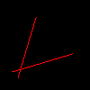
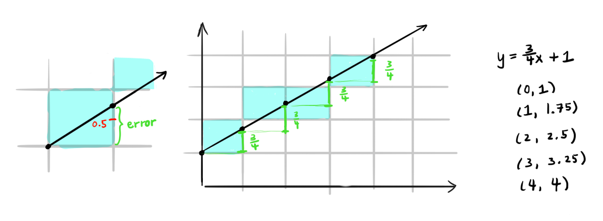
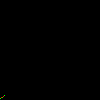

# Tinyrenderer

Following the [tinyrenderer tutorial](https://github.com/ssloy/tinyrenderer/wiki/Lesson-0:-getting-started): "How OpenGL works".

## [Lesson 0: Getting Started](https://github.com/ssloy/tinyrenderer/wiki/Lesson-0:-getting-started)

Download the files from [this commit](https://github.com/ssloy/tinyrenderer/tree/909fe20934ba5334144d2c748805690a1fa4c89f).

Make sure the code builds with `make`. Running the generated binary will create an image:


The top-left corner's coordinates is `(0,0)`. For an 100x100 pixel image, the bottom-right corner's coordinates is `(100, 100)`. So we call `image.flip_vertically()` so that the bottom-left corner becomes the origin.

I created a script `run.sh` that builds and runs the renderer, and saves the images as a PNG.

## [Lesson 1: Bresenham's Line Drawing Algorithm](https://github.com/ssloy/tinyrenderer/wiki/Lesson-1:-Bresenham%E2%80%99s-Line-Drawing-Algorithm)


### First Attempt with Step
`line_with_step`: Drawing a line from `(0,0)` and `(40,40)` with various step sizes between colored pixels.

(Note that the images in this section did not apply `image.flip_vertically()`, so the origin is at the top-left corner)

With a step size of `0.01`:


With a step size of `0.1`:


Step size of `0.01` between `(0, 70)` and `(70,30)`:


### [Second Attempt with Calculated Step](https://github.com/ssloy/tinyrenderer/wiki/Lesson-1:-Bresenham%E2%80%99s-Line-Drawing-Algorithm#second-attempt)

(`image.flip_vertically()` is applied going forward, so the origin is now at the bottom-left corner).

This attempt is doing [linear interpolation](https://en.wikipedia.org/wiki/Linear_interpolation) between the two points.

Three lines were drawn:
* White line: `(13,20)` -> `(80,40)`
* Red line: `(20,13)` -> `(40,80)`
* Red line: `(80,40` -> `(13,20)` (reversed coordinates of the first line, but should render exactly the same)

Only the first two lines were actually drawn, and the second line is spaced out:


The third line was not drawn because `x0` is greater than `x1`, so it never goes into the loop:
```cpp
for (int x=p0.x; x<=p1.x; x++) {
    //
}
```

The steeper the line, the more spaced out the points are. This is because we sample whole number `x` values between `x0` and `x1`. If they are close to each other, the range of `x` values to sample is smaller, so we sample less points.

Drawing some lines to compare the spacing:

```cpp
// Steep lines
line_with_calculated_step(Point(20, 13), Point(23, 80), image, red);
for (int i=0; i<10; i++) {
	int diff = 15* i;
	TGAColor color = red;
	color.b = red.b + (diff + 50);
	color.r = red.r - (diff + 30);
	line_with_calculated_step(Point(20, 13), Point(20+diff, 80), image, color);
}
```


### [Third Attempt with Swapping](https://github.com/ssloy/tinyrenderer/wiki/Lesson-1:-Bresenham%E2%80%99s-Line-Drawing-Algorithm#third-attempt)


First we choose which axis has a large range (`x1-x0` or `y1-y0`) so that we sample enough points to reduce the spacing. Then we interpolate over that axis.


Now the three lines render correctly, with the third line drawn over the first white line:

```cpp
line_with_swap(Point(13, 20), Point(80, 40), image, white);
	line_with_swap(Point(20, 13), Point(40, 80), image, red);
	line_with_swap(Point(80, 40), Point(13, 20), image, red);
```



### [Timings: Fourth Attempt](https://github.com/ssloy/tinyrenderer/wiki/Lesson-1:-Bresenham%E2%80%99s-Line-Drawing-Algorithm#timings-fourth-attempt)

We profile our code by running the line drawing steps `1,000,000` times:
```cpp
for (int i=0; i<1000000; i++) {	
    line_with_swap(Point(13, 20), Point(80, 40), image, white);
    line_with_swap(Point(20, 13), Point(40, 80), image, red);
    line_with_swap(Point(80, 40), Point(13, 20), image, red);
}
```

We use `gprof` to profile our code.

First I updated the Makefile to use the profiling flags:
```make
CPPFLAGS     = -ggdb -g -pg -O0
LDFLAGS      = -pg
```

Then we run the executable as normal, which then generates a `gmon.out` file.

Then we pass in the executable and `gmon.out` to `grof`:
```
gprof tinyrenderer gmon.out > profile.out
```

We can then view the profiling analysis:

```
Flat profile:

Each sample counts as 0.01 seconds.
  %   cumulative   self              self     total           
 time   seconds   seconds    calls  ms/call  ms/call  name    
 57.93      1.90     1.90  3000000     0.00     0.00  line_with_swap(Point, Point, TGAImage&, TGAColor)
 29.27      2.86     0.96 204000000     0.00     0.00  TGAImage::set(int, int, TGAColor)
  7.93      3.12     0.26 207000000     0.00     0.00  TGAColor::TGAColor(TGAColor const&)
  2.74      3.21     0.09                             _init
  1.68      3.27     0.06  6000000     0.00     0.00  Point::Point(int, int)
  0.30      3.27     0.01                             main
  0.15      3.28     0.01        2     2.50     2.50  TGAColor::TGAColor(unsigned char, unsigned char, unsigned char, unsigned char)
```

The left-most column shows the percentage of total time that a function took. So drawing lines took 58% of the total time.

### [Fourth Attempt Continued](https://github.com/ssloy/tinyrenderer/wiki/Lesson-1:-Bresenham%E2%80%99s-Line-Drawing-Algorithm#fourth-attempt-continued)

Re-running actually gives a range of percentages, maybe due to caching?
The percentage of drawing a line ranges from 45-60%.

Using `std::swap()` and calculating `dy`/`dx` outside the loop didn't change it much.

We apply [Bresenham's Algorithm](https://en.wikipedia.org/wiki/Bresenham%27s_line_algorithm).



The ideal line intersects at `y` at a multiple of the slope.

The `error` keeps track of the distance between the bottom edge of the pixel and where the ideal line intersects and leaves the pixel.

If this error exceeds `0.5` (halfway mark of the edge of a pixel), then we increment the y-coordinate.

If we incremented `y`, we subtract `1` from the error (the length of each side of a pixel is `1`). Then when we add the slope value to `error`, this gives us the distance between the next pixel's bottom edge to the point of intersection.

Drawing a line from `(0,1)` to `(4,4)` (with each pixel alternating colors):
```
derror=0.75
---
(0,1); error=0; red=0
---
error=0.75
(1,2); error=-0.25; red=255
---
error=0.5
(2,2); error=0.5; red=0
---
error=1.25
(3,3); error=0.25; red=255
---
error=1
(4,4); error=0; red=0
---
error=0.75
```



I drew both lines to ensure correctness (`line()` is from tinyrenderer):
```cpp
line_with_swap_optimized(Point(80, 40), Point(13, 20), image, red);
line(Point(80, 40), Point(13, 20), image, white);

line_with_swap_optimized(Point(20, 13), Point(40, 80), image, red);
line(Point(20, 13), Point(40, 80), image, white);
```

If my implementation was incorrect, we'd see red pixels:


Running the benchmark of the three lines for 1,000,000 iterations:
```
Flat profile:

Each sample counts as 0.01 seconds.
  %   cumulative   self              self     total           
 time   seconds   seconds    calls  ns/call  ns/call  name    
 45.91      0.79     0.79 204000000     3.85     3.85  TGAImage::set(int, int, TGAColor)
 23.39      1.19     0.40  3000000   133.33   513.26  line_with_swap_optimized(Point, Point, TGAImage&, TGAColor)
 21.05      1.54     0.36 207000000     1.74     1.74  TGAColor::TGAColor(TGAColor const&)
  3.80      1.61     0.07                             TGAImage::get(int, int)
  2.92      1.66     0.05                             _init
  1.75      1.69     0.03                             TGAImage::get_bytespp()
  0.58      1.70     0.01  6000000     1.67     1.67  Point::Point(int, int)
  0.58      1.71     0.01                             main
  0.00      1.71     0.00  3000000     0.00     0.00  std::remove_reference<Point&>::type&& std::move<Point&>(Point&)
  0.00      1.71     0.00  1000000     0.00     0.00  std::enable_if<std::__and_<std::__not_<std::__is_tuple_like<Point> >, std::is_move_constructible<Point>, std::is_move_assignable<Point> >::value, void>::type std::swap<Point>(Point&, Point&)
  0.00      1.71     0.00        2     0.00     0.00  TGAColor::TGAColor(unsigned char, unsigned char, unsigned char, unsigned char)
...
```

Drawing the line now accounts for only 23% of the time, versus the 57% from previous attempts.
