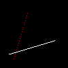
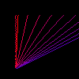

# Tinyrenderer

Following the [tinyrenderer tutorial](https://github.com/ssloy/tinyrenderer/wiki/Lesson-0:-getting-started): "How OpenGL works".

## [Lesson 0: Getting Started](https://github.com/ssloy/tinyrenderer/wiki/Lesson-0:-getting-started)

Download the files from [this commit](https://github.com/ssloy/tinyrenderer/tree/909fe20934ba5334144d2c748805690a1fa4c89f).

Make sure the code builds with `make`. Running the generated binary will create an image:


The top-left corner's coordinates is `(0,0)`. For an 100x100 pixel image, the bottom-right corner's coordinates is `(100, 100)`. So we call `image.flip_vertically()` so that the bottom-left corner becomes the origin.

I created a script `run.sh` that builds and runs the renderer, and saves the images as a PNG.

## [Lesson 1: Bresenham's Line Drawing Algorithm](https://github.com/ssloy/tinyrenderer/wiki/Lesson-1:-Bresenham%E2%80%99s-Line-Drawing-Algorithm)


### First Attempt with Step
`line_with_step`: Drawing a line from `(0,0)` and `(40,40)` with various step sizes between colored pixels.

(Note that the images in this section did not apply `image.flip_vertically()`, so the origin is at the top-left corner)

With a step size of `0.01`:


With a step size of `0.1`:


Step size of `0.01` between `(0, 70)` and `(70,30)`:


### [Second Attempt with Calculated Step](https://github.com/ssloy/tinyrenderer/wiki/Lesson-1:-Bresenham%E2%80%99s-Line-Drawing-Algorithm#second-attempt)

(`image.flip_vertically()` is applied going forward, so the origin is now at the bottom-left corner).

This attempt is doing [linear interpolation](https://en.wikipedia.org/wiki/Linear_interpolation) between the two points.

Three lines were drawn:
* White line: `(13,20)` -> `(80,40)`
* Red line: `(20,13)` -> `(40,80)`
* Red line: `(80,40` -> `(13,20)` (reversed coordinates of the first line, but should render exactly the same)

Only the first two lines were actually drawn, and the second line is spaced out:



The third line was not drawn because `x0` is greater than `x1`, so it never goes into the loop:
```cpp
for (int x=p0.x; x<=p1.x; x++) {
    //
}
```

The steeper the line, the more spaced out the points are. This is because we sample whole number `x` values between `x0` and `x1`. If they are close to each other, the range of `x` values to sample is smaller, so we sample less points.

Drawing some lines to compare the spacing:

```cpp
// Steep lines
line_with_calculated_step(Point(20, 13), Point(23, 80), image, red);
for (int i=0; i<10; i++) {
	int diff = 15* i;
	TGAColor color = red;
	color.b = red.b + (diff + 50);
	color.r = red.r - (diff + 30);
	line_with_calculated_step(Point(20, 13), Point(20+diff, 80), image, color);
}
```


### [Third Attempt with Swapping](https://github.com/ssloy/tinyrenderer/wiki/Lesson-1:-Bresenham%E2%80%99s-Line-Drawing-Algorithm#third-attempt)


First we choose which axis has a large range (`x1-x0` or `y1-y0`) so that we sample enough points to reduce the spacing. Then we interpolate over that axis.



Now the three lines render correctly, with the third line drawn over the first white line:

```cpp
line_with_swap(Point(13, 20), Point(80, 40), image, white);
	line_with_swap(Point(20, 13), Point(40, 80), image, red);
	line_with_swap(Point(80, 40), Point(13, 20), image, red);
```


