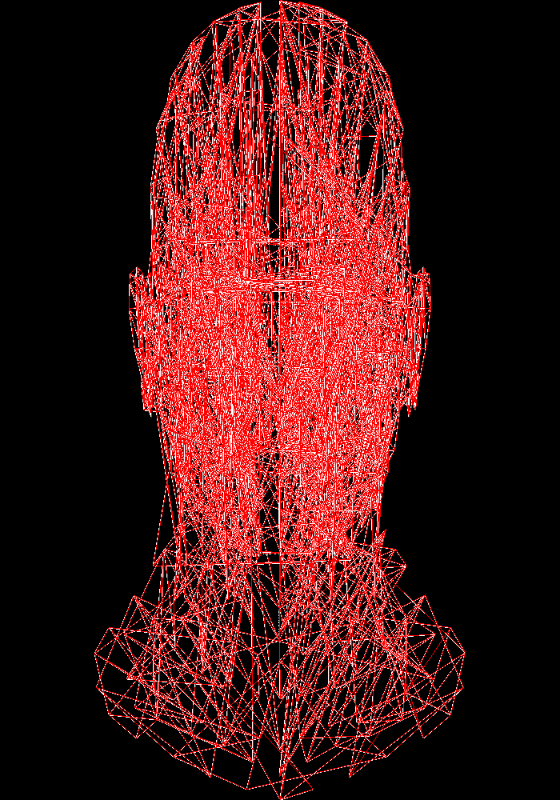

# [Lesson 1: Bresenham's Line Drawing Algorithm](https://github.com/ssloy/tinyrenderer/wiki/Lesson-1:-Bresenham%E2%80%99s-Line-Drawing-Algorithm)

## [Lesson 0: Getting Started](https://github.com/ssloy/tinyrenderer/wiki/Lesson-0:-getting-started)

Download the files from [this commit](https://github.com/ssloy/tinyrenderer/tree/909fe20934ba5334144d2c748805690a1fa4c89f).

Make sure the code builds with `make`. Running the generated binary will create an image:


The top-left corner's coordinates is `(0,0)`. For an 100x100 pixel image, the bottom-right corner's coordinates is `(100, 100)`. So we call `image.flip_vertically()` so that the bottom-left corner becomes the origin.

I created a script `run.sh` that builds and runs the renderer, and saves the images as a PNG.

## [Lesson 1: Bresenham's Line Drawing Algorithm](https://github.com/ssloy/tinyrenderer/wiki/Lesson-1:-Bresenham%E2%80%99s-Line-Drawing-Algorithm)


### First Attempt with Step
`line_with_step`: Drawing a line from `(0,0)` and `(40,40)` with various step sizes between colored pixels.

(Note that the images in this section did not apply `image.flip_vertically()`, so the origin is at the top-left corner)

With a step size of `0.01`:


With a step size of `0.1`:


Step size of `0.01` between `(0, 70)` and `(70,30)`:


### [Second Attempt with Calculated Step](https://github.com/ssloy/tinyrenderer/wiki/Lesson-1:-Bresenham%E2%80%99s-Line-Drawing-Algorithm#second-attempt)

(`image.flip_vertically()` is applied going forward, so the origin is now at the bottom-left corner).

This attempt is doing [linear interpolation](https://en.wikipedia.org/wiki/Linear_interpolation) between the two points.

Three lines were drawn:
* White line: `(13,20)` -> `(80,40)`
* Red line: `(20,13)` -> `(40,80)`
* Red line: `(80,40` -> `(13,20)` (reversed coordinates of the first line, but should render exactly the same)

Only the first two lines were actually drawn, and the second line is spaced out:


The third line was not drawn because `x0` is greater than `x1`, so it never goes into the loop:
```cpp
for (int x=p0.x; x<=p1.x; x++) {
    //
}
```

The steeper the line, the more spaced out the points are. This is because we sample whole number `x` values between `x0` and `x1`. If they are close to each other, the range of `x` values to sample is smaller, so we sample less points.

Drawing some lines to compare the spacing:

```cpp
// Steep lines
line_with_calculated_step(Point(20, 13), Point(23, 80), image, red);
for (int i=0; i<10; i++) {
	int diff = 15* i;
	TGAColor color = red;
	color.b = red.b + (diff + 50);
	color.r = red.r - (diff + 30);
	line_with_calculated_step(Point(20, 13), Point(20+diff, 80), image, color);
}
```


### [Third Attempt with Swapping](https://github.com/ssloy/tinyrenderer/wiki/Lesson-1:-Bresenham%E2%80%99s-Line-Drawing-Algorithm#third-attempt)


First we choose which axis has a large range (`x1-x0` or `y1-y0`) so that we sample enough points to reduce the spacing. Then we interpolate over that axis.


Now the three lines render correctly, with the third line drawn over the first white line:

```cpp
line_with_swap(Point(13, 20), Point(80, 40), image, white);
	line_with_swap(Point(20, 13), Point(40, 80), image, red);
	line_with_swap(Point(80, 40), Point(13, 20), image, red);
```


### [Timings: Fourth Attempt](https://github.com/ssloy/tinyrenderer/wiki/Lesson-1:-Bresenham%E2%80%99s-Line-Drawing-Algorithm#timings-fourth-attempt)

We profile our code by running the line drawing steps `1,000,000` times:
```cpp
for (int i=0; i<1000000; i++) {	
    line_with_swap(Point(13, 20), Point(80, 40), image, white);
    line_with_swap(Point(20, 13), Point(40, 80), image, red);
    line_with_swap(Point(80, 40), Point(13, 20), image, red);
}
```

We use `gprof` to profile our code.

First I updated the Makefile to use the profiling flags:
```make
CPPFLAGS     = -ggdb -g -pg -O0
LDFLAGS      = -pg
```

Then we run the executable as normal, which then generates a `gmon.out` file.

Then we pass in the executable and `gmon.out` to `grof`:
```
gprof tinyrenderer gmon.out > profile.out
```

We can then view the profiling analysis:

```
Flat profile:

Each sample counts as 0.01 seconds.
  %   cumulative   self              self     total           
 time   seconds   seconds    calls  ms/call  ms/call  name    
 57.93      1.90     1.90  3000000     0.00     0.00  line_with_swap(Point, Point, TGAImage&, TGAColor)
 29.27      2.86     0.96 204000000     0.00     0.00  TGAImage::set(int, int, TGAColor)
  7.93      3.12     0.26 207000000     0.00     0.00  TGAColor::TGAColor(TGAColor const&)
  2.74      3.21     0.09                             _init
  1.68      3.27     0.06  6000000     0.00     0.00  Point::Point(int, int)
  0.30      3.27     0.01                             main
  0.15      3.28     0.01        2     2.50     2.50  TGAColor::TGAColor(unsigned char, unsigned char, unsigned char, unsigned char)
```

The left-most column shows the percentage of total time that a function took. So drawing lines took 58% of the total time.

### [Fourth Attempt Continued](https://github.com/ssloy/tinyrenderer/wiki/Lesson-1:-Bresenham%E2%80%99s-Line-Drawing-Algorithm#fourth-attempt-continued)

Re-running actually gives a range of percentages, maybe due to caching?
The percentage of drawing a line ranges from 45-60%.

Using `std::swap()` and calculating `dy`/`dx` outside the loop didn't change it much.

We apply [Bresenham's Algorithm](https://en.wikipedia.org/wiki/Bresenham%27s_line_algorithm).


The ideal line intersects at `y` at a multiple of the slope.

The `error` keeps track of the distance between the bottom edge of the pixel and where the ideal line intersects and leaves the pixel.

If this error exceeds `0.5` (halfway mark of the edge of a pixel), then we increment the y-coordinate.

If we incremented `y`, we subtract `1` from the error (the length of each side of a pixel is `1`). Then when we add the slope value to `error`, this gives us the distance between the next pixel's bottom edge to the point of intersection.

Drawing a line from `(0,1)` to `(4,4)` (with each pixel alternating colors):
```
derror=0.75
---
(0,1); error=0; red=0
---
error=0.75
(1,2); error=-0.25; red=255
---
error=0.5
(2,2); error=0.5; red=0
---
error=1.25
(3,3); error=0.25; red=255
---
error=1
(4,4); error=0; red=0
---
error=0.75
```


I drew both lines to ensure correctness (`line()` is from tinyrenderer):
```cpp
line_with_swap_optimized(Point(80, 40), Point(13, 20), image, red);
line(Point(80, 40), Point(13, 20), image, white);

line_with_swap_optimized(Point(20, 13), Point(40, 80), image, red);
line(Point(20, 13), Point(40, 80), image, white);
```

If my implementation was incorrect, we'd see red pixels:


Running the benchmark of the three lines for 1,000,000 iterations:
```
Flat profile:

Each sample counts as 0.01 seconds.
  %   cumulative   self              self     total           
 time   seconds   seconds    calls  ns/call  ns/call  name    
 45.91      0.79     0.79 204000000     3.85     3.85  TGAImage::set(int, int, TGAColor)
 23.39      1.19     0.40  3000000   133.33   513.26  line_with_swap_optimized(Point, Point, TGAImage&, TGAColor)
 21.05      1.54     0.36 207000000     1.74     1.74  TGAColor::TGAColor(TGAColor const&)
  3.80      1.61     0.07                             TGAImage::get(int, int)
  2.92      1.66     0.05                             _init
  1.75      1.69     0.03                             TGAImage::get_bytespp()
  0.58      1.70     0.01  6000000     1.67     1.67  Point::Point(int, int)
  0.58      1.71     0.01                             main
  0.00      1.71     0.00  3000000     0.00     0.00  std::remove_reference<Point&>::type&& std::move<Point&>(Point&)
  0.00      1.71     0.00  1000000     0.00     0.00  std::enable_if<std::__and_<std::__not_<std::__is_tuple_like<Point> >, std::is_move_constructible<Point>, std::is_move_assignable<Point> >::value, void>::type std::swap<Point>(Point&, Point&)
  0.00      1.71     0.00        2     0.00     0.00  TGAColor::TGAColor(unsigned char, unsigned char, unsigned char, unsigned char)
...
```

Drawing the line now accounts for only 23% of the time, versus the 57% from previous attempts.

### [Timings: Fifth and final attempt](https://github.com/ssloy/tinyrenderer/wiki/Lesson-1:-Bresenham%E2%80%99s-Line-Drawing-Algorithm#timings-fifth-and-final-attempt)

(`line_with_swap()` above was renamed to `line_no_multiply()`).

This [explanation](https://www.cs.helsinki.fi/group/goa/mallinnus/lines/bresenh.html) was a good source on how to remove floating point.

In the above logic we compared `error` with 0.5:
```C++
error += slope;
if (error < 0.5) {
  ///
}
```

We can rewrite this comparison like:
```C++
if (error + slope < 0.5)
```

We can write the slope in terms of `dy` and `dx`
```
error + dy/dx < 0.5
```

Multiply by 2 on both sides to get an integer:
```
2(error + dy/dx) < 1
2*error + 2*dy/dx < 1
```

Multiply by `dx` to remove the division from the slope:
```
(dx)(2*error + 2*dy/dx) < (dx)1
2*dx*error + 2*dy < dx
2(dx*error + dy) < dx
```

The update rule (for when the comparison is false) in the fractional version for `error` was:
```C++
error = error + slope - 1
```

Rewrite the update rule:
```
error = error + dy/dx - 1
```

Multiply by `dx` to remove the division in the slope:
```
dx(error) = dx(error + dy/dx - 1)
dx*error = dx*error + dy - dx
```

Recall the comparison rule is now:
```
2(dx*error + dy) < dx
2*dx*error + 2*dy < dx
```

The update rule is now:
```
dx*error = dx*error + dy - dx
2*dx*error = 2*dx*error + 2*dy - 2*dx
```

We can rewrite `2*dx*error` as the new `error'` variable:
Comparison:
```
error' + 2*dy < dx
```

Update:
```
error' = error' + 2*dy - 2dx
```

We still have multiplies but they are only multiplies by 2, which can be efficiently calculated by left-shift.

In the loop (for each x), we add `2*dy` to `error'`.

New performance profile:
```
Flat profile:

Each sample counts as 0.01 seconds.
  %   cumulative   self              self     total           
 time   seconds   seconds    calls  ns/call  ns/call  name    
 43.40      0.69     0.69 204000000     3.38     3.38  TGAImage::set(int, int, TGAColor)
 26.42      1.11     0.42  3000000   140.00   481.74  line_no_floating_point(Point, Point, TGAImage&, TGAColor)
 20.75      1.44     0.33 207000000     1.59     1.59  TGAColor::TGAColor(TGAColor const&)
  3.77      1.50     0.06                             TGAImage::get(int, int)
  1.89      1.53     0.03                             TGAImage::get_bytespp()
  1.89      1.56     0.03                             main
  0.63      1.57     0.01  6000000     1.67     1.67  Point::Point(int, int)
  0.63      1.58     0.01  3000000     3.33     3.33  std::remove_reference<Point&>::type&& std::move<Point&>(Point&)
  0.63      1.59     0.01                             _init
  0.00      1.59     0.00  1000000     0.00    10.00  std::enable_if<std::__and_<std::__not_<std::__is_tuple_like<Point> >, std::is_move_constructible<Point>, std::is_move_assignable<Point> >::value, void>::type std::swap<Point>(Point&, Point&)
  0.00      1.59     0.00        2     0.00     0.00  TGAColor::TGAColor(unsigned char, unsigned char, unsigned char, unsigned char)
  ... 
```

The drawing line call decreased from `1.19` seconds to `1.11` seconds.

Huh, slower with a constant reference to color:
```
Flat profile:

Each sample counts as 0.01 seconds.
  %   cumulative   self              self     total           
 time   seconds   seconds    calls  ns/call  ns/call  name    
 49.74      0.94     0.94 204000000     4.61     4.61  TGAImage::set(int, int, TGAColor)
 24.87      1.41     0.47  3000000   156.67   585.00  line_no_floating_point(Point, Point, TGAImage&, TGAColor const&)
 18.25      1.75     0.34 204000000     1.69     1.69  TGAColor::TGAColor(TGAColor const&)

```

Acutally the time fluctuates a lot...

### [Wireframe Rendering](https://github.com/ssloy/tinyrenderer/wiki/Lesson-1:-Bresenham%E2%80%99s-Line-Drawing-Algorithm#wireframe-rendering)

[Wavefront Obj](https://en.wikipedia.org/wiki/Wavefront_.obj_file) is a file format that stores 3D geometry definitions (developed by a company called Wavefront Technologies), storing vertices, UV coordinates for textures, faces, and normal vectors.

First attempt in a `500x700` sized image:


Time to debug!!

Looks like my line implementation is also buggy, it does not align perfectly with tinyrenderer's (in red):


(Still looks incorrect thought, but *better*):


If we compare one face, for example, the Face at index `2000`:
```
0: Drawing a line from Vec3(-0.183941, -0.499632, 0.122144) to Vec3(-0.142059, 0.263388, 0.482491)
Drawing a normalized line from Point(285, 250, 0) to Point(300, 631, 0) with color: white
---
1: Drawing a line from Vec3(-0.142059, 0.263388, 0.482491) to Vec3(-0.065825, -0.384532, 0.440825)
Drawing a normalized line from Point(300, 631, 0) to Point(326, 307, 0) with color: red
---
2: Drawing a line from Vec3(-0.065825, -0.384532, 0.440825) to Vec3(-0.183941, -0.499632, 0.122144)
Drawing a normalized line from Point(326, 307, 0) to Point(285, 250, 0) with color: green
---

```

Our implementation does not close the face:


The implementation up until `line_with_swap()` was closest to tinyrenderer's (in red):


(funky art)


🪲 The BUG! Was the off-by-one indexing when indexing into the vertices array:
```cpp
// Did not subtract by 1 here....
Vec3& v0 = vertices[vi_0.vertex_index];
Vec3& v1 = vertices[vi_1.vertex_index];
```
Wavefront Obj file indexing starts at 1...

After the fix ✨:


Now I gotta fix my line implementation (above used `line_with_swap()`...)

There are also lines missing at the neck base. This is what it *should* look like  (using tinyrenderer's line):


🪲 The BUG! was not handling the case where the y coordinate decreased as x-coordinates increased, and as the y-coordinate increased and the x-coordinates decreased (in other words, negative slopes).


In the case where y decreases as x-increases, that means dy is negative.
```cpp
error += dy_2;
if (error > dx) {
    y += 1;
    error -= dx_2;
}
```
This means that the error is always decreasing when we add `dy_2`, which is negative.
Which is why `error > dx` will never be true, preventing the y-value from ever changing.

This is why we'd only get straight lines drawn for negative slopes (for example, the straight red line above that did not close the triangle). Also, we have to decrease the the pixel's y-value when a update is needed (since y is decreasing  across the line).

The solution was to check if `dy` is negative, then use a different update value `yi` (either 1 or -1):
```cpp
int yi = 1;
if (dy < 1) {
    yi = -1;
}
```

We also use the absolute value of `dy_2`:
```cpp
int dx_2 = 2*dx;
int dy_2 = 2*abs(dy);
```

So that the error accumulates:
```cpp
error += dy_2;
```

We apply similar logic to when the y-range is greater than the x-range.

`line_with_floating_point()` is fixed!


