# [Lesson 2: Triangle Rasterization and Back Face Culling](https://github.com/ssloy/tinyrenderer/wiki/Lesson-2:-Triangle-rasterization-and-back-face-culling)

## Filling Triangles

### Old-school Method: Line sweeping
We can use our line implementation to draw a triangle:

```cpp
void triangle(std::vector<Point> t, TGAImage& image, TGAColor color) {
    line(t[0], t[1], image, color);
    line(t[1], t[2], image, color);
    line(t[2], t[0], image, color);
}
```


Einfach! Now how to draw a *filled* triangle? ...

**Naive Attempt 1**

Pick a corner of a triangle, and from that corner, draw a point to every point in the base of the triangle.

I modified the line drawing algorithm to return all the points that were used to draw the line.

There are still holes in the triangle... (looks funky-ly cool though)

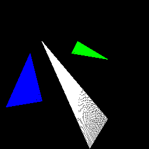

**Naive Attempt 2**

Choose the longest side, and draw lines from the other two sides

Still full of holes...

One side:

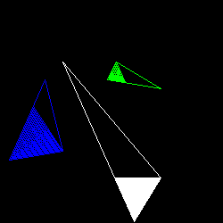

The other side:

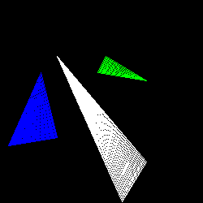

Both halves:

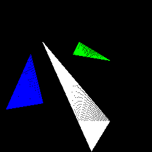

Returning the Points that were used to draw a line is a waste of memory too...

**Better Way**

Using only straight lines to fill a triangle would guarentee not to have small gaps inside the triangle 💡

We first sort the three points of the triangle by increasing y-coordinate: `t0`, `t1`, `t2`. Then draw the following lines:
* `t0` --- `t1`
* `t1` --- `t2`
* `t2` --- `t0`

We can label the triangle into two parts: `A`and `B`:

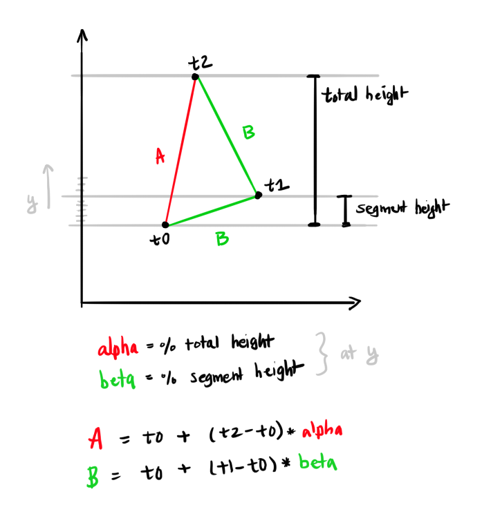

`A` has the tallest height (since we connected the points with the highest y-coordinate and the lowest y-coordinate). We can then split the height with the two other sides into segments, both labelled `B`.

First let's only look at the first segment `B`, from `t0` --- `t1`:


What we are doing here is increasing `y` by 1 incrementally at each step. At each step, we check what percentage of of the total segment height we are at: `beta`. And also what percentage of the total height of the triangle we are at: `alpha`.

At a given `y`, we get the percentages `alpha` and `beta`. We use `beta` to find the x-coordinate of the point that is `beta` percent of the segment's width.

For example, let's say at a given `y` we are 30% of the total segment, so `beta` = 30%. We use this percentage to find the x-coordinate that is 30% of the total segment width:

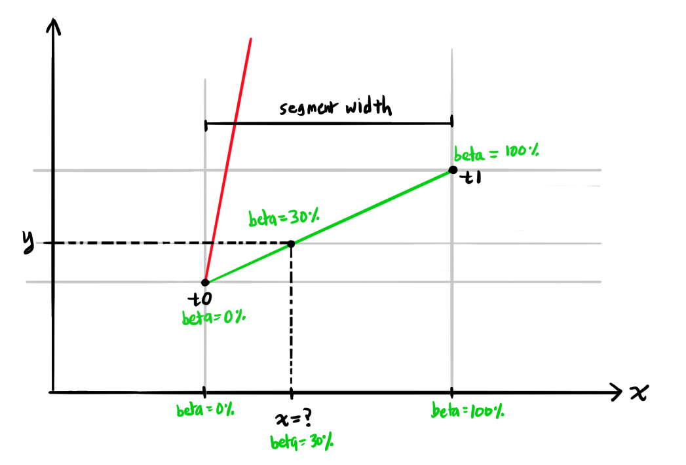

We do the same thing for finding the x-coordinate for the point on `A`.

Because the y-coordinate is the same for the point on segment `B` and the point on `A`, we can then draw a straight horizontal line between these points.

Some bugs 🪲:
```cpp
for (int y=0; y<t[1].y; y++) { // <--- need to start at t[0].y, not 0
    float alpha = y / total_height; // <--- need to divide (t0.y - y); use float
    float beta = y / segment_height; // 
    //...
}
```

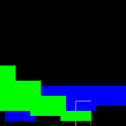

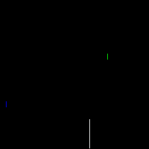

Fixed! ✨

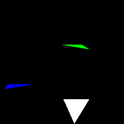

**Filling the top half**

Some bugs 🪲:

Naively did the same thing as the bottom segment for the top segment (just adjusting which points to use):

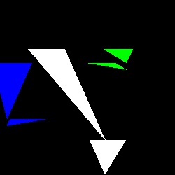

Draws a horizontally flipped version of the intended triangle...

Account for decreasing x-coordinate as y increases:
```cpp
// x-coordinate on upper B segment
int b_dx = (t[2].x - t[1].x);
int bx = 0;
if (b_dx >= 0) {
    bx = t[0].x + b_dx*beta;
} else {
    // The segment's x-coordinate decreases as the y-coordinate increases
    bx = t[0].x + b_dx*(1-beta);
}
```

Still a wierd mess:

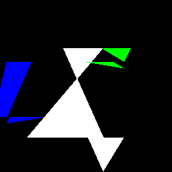

`alpha` should still a percentage of the height of `A`:

```cpp
float alpha = (float)(y - t[0].y) / total_height;
```

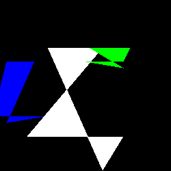

Started the segment's x-coordinate at `t0` instead of `t1`:
```cpp
int bx = t[0].x + (t[2].x - t[1].x)*beta; // <-- need to use t1. + ...
```

Also removed the negative slope handling.

Fixed!! ✨

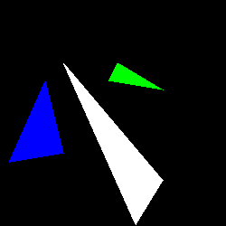

Interestingly we do not have to check for a negative slope for the segments when computing the x-coordinate. When the line has a negative slope, the segments width is negative, which naturally decreases the x-coordinate as the y-coordinate increases.

**Cleanup**

Combined the two loops into one, and manually drew the line instead of using `line()` since we know that it is a straight line (no need to calculate error, etc);
```cpp
// Draw a straight line    
if (ax > bx) std::swap(ax, bx); 
for (int x=ax; x<=bx; x++) {
    image.set(x, y, color); 
}
```

### [Bounding box method](https://github.com/ssloy/tinyrenderer/wiki/Lesson-2:-Triangle-rasterization-and-back-face-culling#the-method-i-adopt-for-my-code)

**Understanding Barycentric coordinates**

[This document](https://users.csc.calpoly.edu/~zwood/teaching/csc471/2017F/barycentric.pdf) was a very good explanation of Barycentric coordinates. The following are notes from that document.

*Barycentric coordinates* are coordinates defined to be relative to a set of chosen coordinates.

zB If we have a triangle of three points, `a`, `b`, `c`, then a Point `p` would be defined in relation to `a`, `b`, `c`. We use constants to define this relation.

We create a coordinate system with basis vector `a->c`, and `a->b`.

We go in the `a->c` direction with some constant gamma `γ`, and the `a->b` direction with some constant beta `β`:

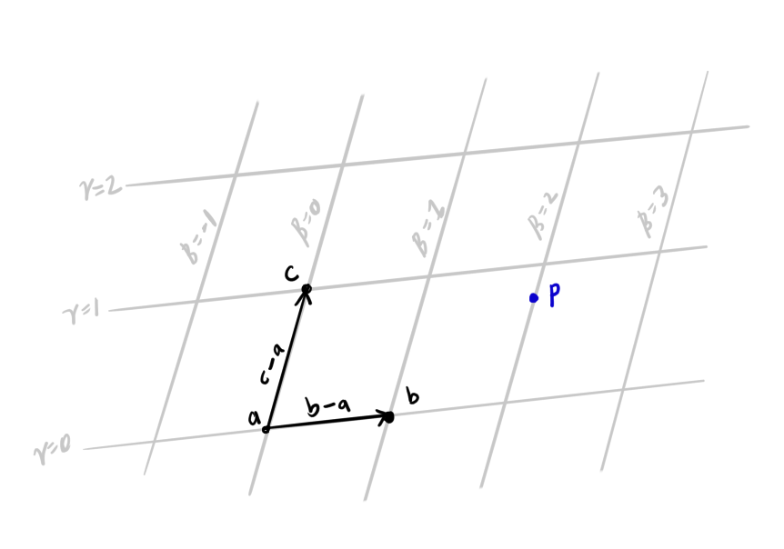

We can then use the constants `γ` and `β` to define where point `p` is on this plane.

Let's try to get `p` in terms of the points `a`, `b`, and `c`.

We can think of getting to point `p` from point `a`, using the basis vectors `a->b` and `a->c`:
```
p = a + β*(a->b) +  γ*(a->c)
```

We can also represent a vector as a subtraction of two points:

```
p = a + β*(b-a) +  γ*(c-a)
```

Distribute the constants:
```
p = a + β*b - β*a + γ*c - γ*a
```

Rearrange the terms:
```
p = a - β*a - γ*a + β*b + γ*c
```

Now we get point `p` in terms of points `a`, `b`, and `c`:
```
p = (1 - β - γ)*a + β*b + γ*c 
```

We rewrite the coefficient of `a` with alpha `α`:
```
α = 1 - β - γ 
```

Then we can rewrite the equation:
```
p = α*a + β*b + γ*c 
```

The coefficients `α`, `β` and `γ` have the constraint that they must add to 1:
```
α + β + γ = 1
```

We can plot various points on this plane to see how the coeffiicents change:

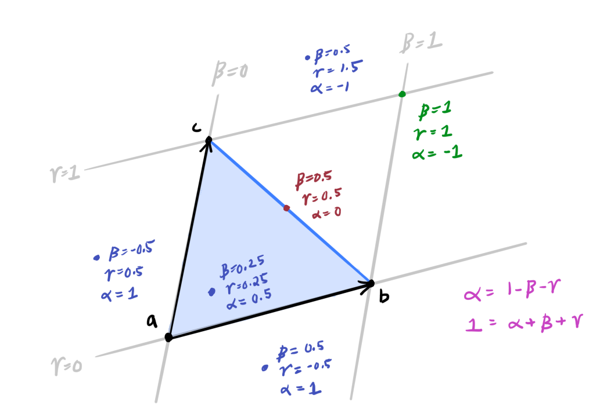

We can see how the coefficients tell us where a point is relative to the triangle created by points `a`, `b`, and `c`!

#### Finding the coefficients
We need to find the coeffients `β` and `γ` that represent point `p`.

No matter what point `p` we choose, the following vectors add up to zero:
```
β*(a->b) + γ*(a->c) + (p->a) = 0
```

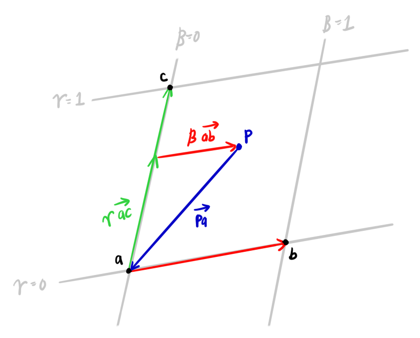

We can set up that equation to find the x and y coordinate of `p` in terms of `β` and `γ`:

```
β*(a->b)_x + γ*(a->c)_x + (p->a)_x = 0
β*(a->b)_y + γ*(a->c)_y + (p->a)_y = 0
```

`(a->b)_x` means the x-component of the vector `(a->b)`.

(from now on we will use `u` for `β` and `v` for `γ` to follow the tinyrenderer docs).

We can rewrite the above equations in matrix form:

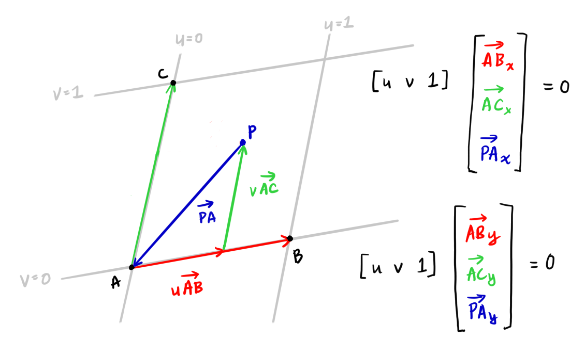

If we multiply the matrix out, we can see that it is equivalent to the equation we had above:

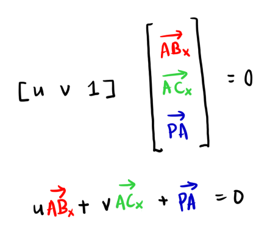

This particular matrix multiply is actually equivalent to the dot product. And we know that if the dot product is 0, then the two vectors are *orthogonal* to each other!

In other words, the vector we are trying to find `[u, v, 1]` is perpendicular to `[(A->B), (A->C), (P->A)]`.

Specifically, we need these two equations to be true at the same time:

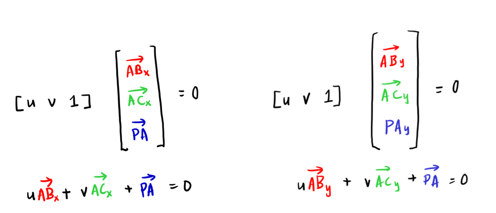

We can take the cross-product of the two vectors, `[(A->B)_x, (A->C)_x, (P->A)_y]` and `[(A->B)_y, (A->C)_y, (P->A)_y]`, which would return a vector that is perpendicular to both vectors, in this case, `[u, v, 1]`.


Once we have the coefficients `[u, v, 1]`, we can then determine whether point `p` is in the triangle or not.

We restrict which pixels to look at by computing a bounding box. This can be computed by taking the lowest x and y coordinates as the bottom-left corner of the box, and the highest x and y coordinate as the top-right corner of the box:

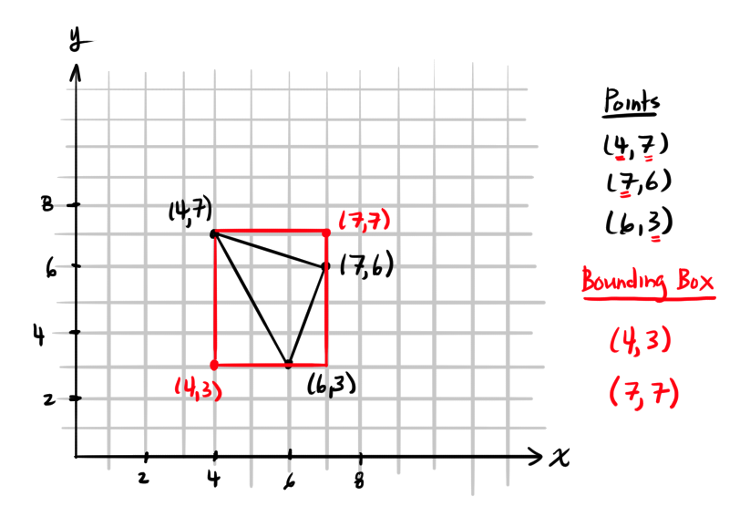

We can also apply clipping to the bounding box for the case where part of the triangle is off the canvas.

This is so that we don't unnecessarily iterate through triangle pixels off the canvas that we know we won't color in.

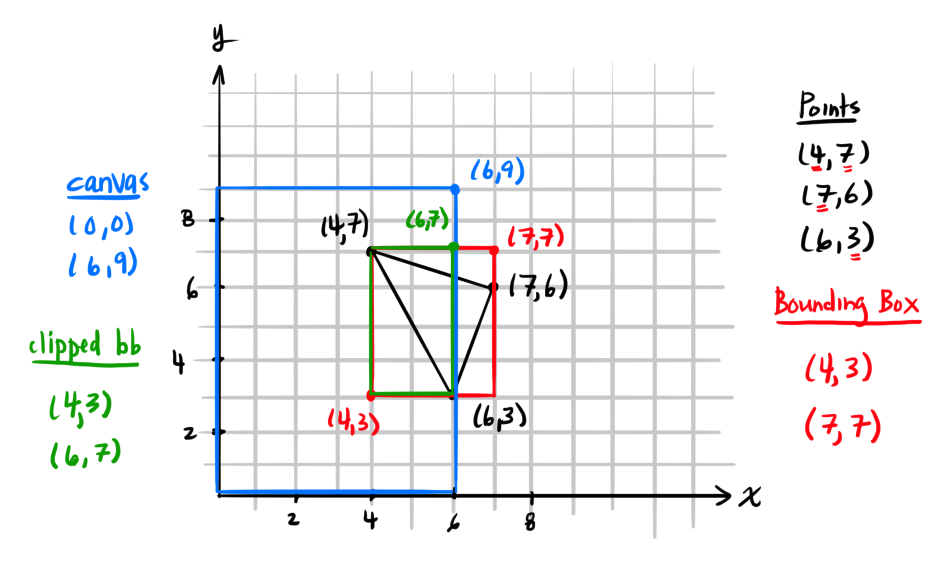

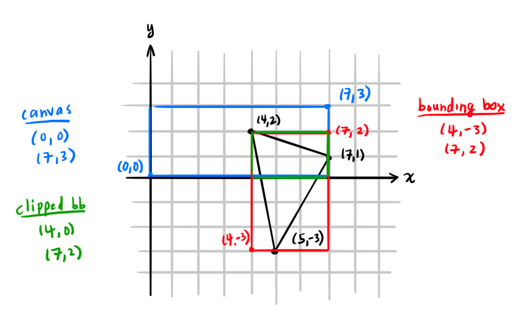

Bugs 🪲:

Did not actually compute the coefficients after computing the cross product.

One of the coefficients is `1 - u - v`.

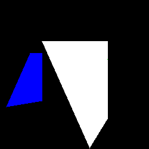

We also need to divide the cross product by the z-coordinate since we are looking for the vector `[u, v, 1]`.

```cpp
coefficients.push_back(cross_product[0]/cross_product[2]);
coefficients.push_back(cross_product[1]/cross_product[2]);
coefficients.push_back(1 - (cross_product[0] + cross_product[1])/cross_product[2]);
```

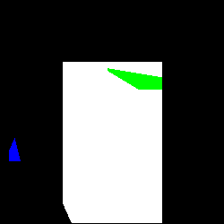

Hmm.... still not right...

Was casting the coefficients to integers instead of floats.

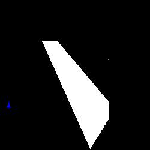

Ugh.

Interestingly... the *order* of the points inside the vectors that we choose for v0 and v1 (whose cross product we find) effects the result we get.

For a triangle whose points are:
```cpp
std::vector<Point> t3 = {
	Point(10,10),
	Point(100, 30),
	Point(190, 160)
}; 
```

```cpp
// Rewrite as variables for readability....
Point a = t[0];
Point b = t[1];
Point c = t[2];
```


```cpp
std::vector<int> v0 = {
    (c-a).x,
    (b-a).x,
    (a-p).x
};

std::vector<int> v1 = {
    (c-a).y,
    (b-a).y,
    (a-p).y
};
```

(Blue triangle is the correct triangle, so it is still a bit off. And the gray is the bounding box):

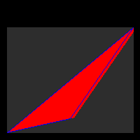

Then with vectors (we swapped the first two values):
```cpp
std::vector<int> v0 = {
    (b-a).x,
    (c-a).x,
    (a-p).x
};

std::vector<int> v1 = {
    (b-a).y,
    (c-a).y,
    (a-p).y
};
```

It is not drawn at all:

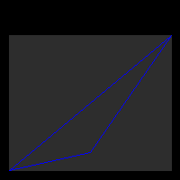

The BUG!  🪲 Was incorrectly computing the cross product OTL


```cpp
std::vector<int> cross_product = {
    v0[1]*v1[2] - v0[2]*v1[1],
    v0[2]*v1[0] - v0[0]*v1[2],
    v1[0]*v1[1] - v0[1]*v1[0] // <--- Should be v0[0]*v1[1] - v0[1]*v1[0]
};
```

One way to find bugs is to do the same math with paper and pencil, by hand...

✨

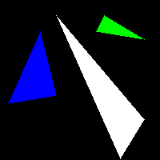

## [Flat shading renderer](https://github.com/ssloy/tinyrenderer/wiki/Lesson-2:-Triangle-rasterization-and-back-face-culling#flat-shading-render)

We can now use our filled_triangle function to color our model:

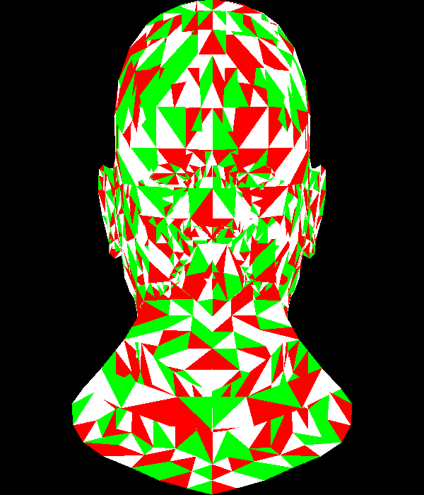

Random face colors:

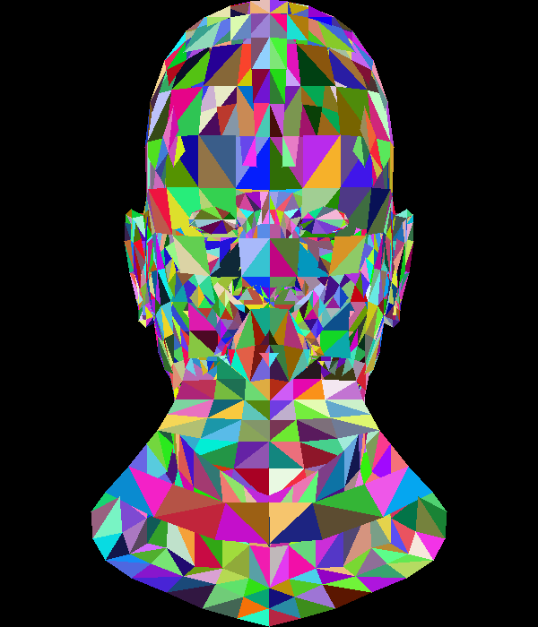

Took about 10 seconds to render:
```
real    0m10.382s
user    0m10.004s
sys     0m0.330s
```

### Simple Lighting and Shading

We need two vectors for each triangle: the light vector, and the normal vector of the triangle.

To compute the light vector, we need to compute the triangle's center position, then we can create a vector from this center position to the light's position.

The [center of a triangle (or *centroid*)](https://en.wikipedia.org/wiki/Centroid#Of_a_triangle) is the point of intersection when you draw a line from each vertex to the midpoint of the opposite side of the triangle:

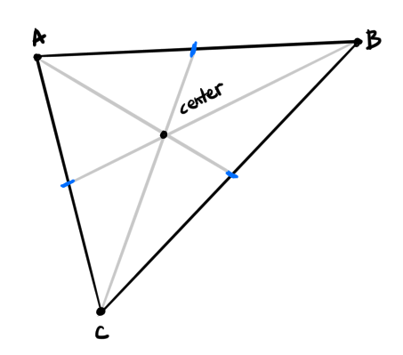

The centroid can be computed by taking the mean of the x and y coordinates of the triangle:

```cpp
triangle_center = Point(
    (v0.x + v1.x + v2.x)/3 // x-coordinate
    (v0.y + v1.y + v2.y)/3 // y-coordinate
)
```

Then we can create a vector from the triangle's centroid to the light position to get the light vector:

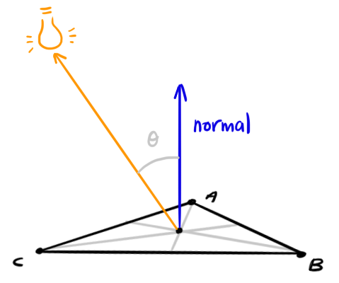
