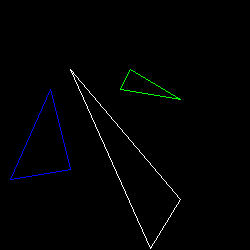
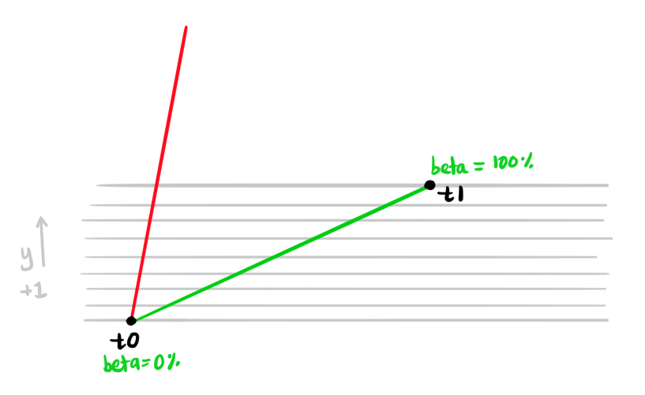

# [Lesson 2: Triangle Rasterization and Back Face Culling](https://github.com/ssloy/tinyrenderer/wiki/Lesson-2:-Triangle-rasterization-and-back-face-culling)

## Filling Triangles

### Old-school Method: Line sweeping
We can use our line implementation to draw a triangle:

```cpp
void triangle(std::vector<Point> t, TGAImage& image, TGAColor color) {
    line(t[0], t[1], image, color);
    line(t[1], t[2], image, color);
    line(t[2], t[0], image, color);
}
```



Einfach! Now how to draw a *filled* triangle? ...

**Naive Attempt 1**

Pick a corner of a triangle, and from that corner, draw a point to every point in the base of the triangle.

I modified the line drawing algorithm to return all the points that were used to draw the line.

There are still holes in the triangle... (looks funky-ly cool though)


**Naive Attempt 2**

Choose the longest side, and draw lines from the other two sides

Still full of holes...

One side:


The other side:


Both halves:


Returning the Points that were used to draw a line is a waste of memory too...

**Better Way**

Using only straight lines to fill a triangle would guarentee not to have small gaps inside the triangle 💡

We first sort the three points of the triangle by increasing y-coordinate: `t0`, `t1`, `t2`. Then draw the following lines:
* `t0` --- `t1`
* `t1` --- `t2`
* `t2` --- `t0`

We can label the triangle into two parts: `A`and `B`:


`A` has the tallest height (since we connected the points with the highest y-coordinate and the lowest y-coordinate). We can then split the height with the two other sides into segments, both labelled `B`.

First let's only look at the first segment `B`, from `t0` --- `t1`:



What we are doing here is increasing `y` by 1 incrementally at each step. At each step, we check what percentage of of the total segment height we are at: `beta`. And also what percentage of the total height of the triangle we are at: `alpha`.

At a given `y`, we get the percentages `alpha` and `beta`. We use `beta` to find the x-coordinate of the point that is `beta` percent of the segment's width.

For example, let's say at a given `y` we are 30% of the total segment, so `beta` = 30%. We use this percentage to find the x-coordinate that is 30% of the total segment width:


We do the same thing for finding the x-coordinate for the point on `A`.

Because the y-coordinate is the same for the point on segment `B` and the point on `A`, we can then draw a straight horizontal line between these points.

Some bugs 🪲:
```cpp
for (int y=0; y<t[1].y; y++) { // <--- need to start at t[0].y, not 0
    float alpha = y / total_height; // <--- need to divide (t0.y - y); use float
    float beta = y / segment_height; // 
    //...
}
```


Fixed! ✨


