# [Hidden Faces Removal (z-buffer)](https://github.com/ssloy/tinyrenderer/wiki/Lesson-3:-Hidden-faces-removal-(z-buffer))

The problem with our current renderer is that the triangles must already be in the correct depth order relative to a fixed position of the camera for them to be rendered correctly. Otherwise, we'd have triangles that are supposed to be behind other triangles drawn over previously-drawn triangles, even if the triangles are closer to the camera.

It's not efficient to always sort triangles by depth ([painter's algorithm](https://en.wikipedia.org/wiki/Painter%27s_algorithm)) - scenes can change dynamically, and re-sorting triangles at every scene change is expensive. Also it might not always be possible to sort triangles by depth if triangles intersect into each other in a certain way.

Let's say we have a 3D scene like this, with three triangles, and a square to represent the screen (images from tinyrenderer):


If we look at this scene from the top (at some height `y` along the y-axis) we'd see:


We can't sort the triangles by distance to the camera - is the blue triangle closer or is the green triangle closer? Is the red triangle in front of the blue triangle? Etc.

## [Draw widthx1 image of the scene](https://raw.githubusercontent.com/ssloy/tinyrenderer/gh-pages/img/03-zbuffer/023668cb8ea97f59bf87d982c1e8b030.png)

Let's try to draw one line of pixels of the scene viewed from some height `y` along the y-axis (as above).

Essentially we are putting in a plane along the y-axis in the scene:


and we only draw the pixels that are within this plane and the scene viewed from the top:


How would we render just that one line of pixels?

We need to consider the height *of the position* of each part of the triangle. If we look at the 3D scene from the side, we can more easily see the height of the triangle's position:


We need to keep track of the largest height position seen of each pixel along the x-axis (this is a sliding window across the x-axis of the widthx1 image). If a part of a triangle's position is shorter than another triangle's position, then we do not color that part of the triangle that is underneath that other triangle.

To keep track of the triangle position's height (y-values of each position in the triangle), we store them in a *y-buffer*, which is an array of `image_width` values, holding the position height seen at each x-value in the image. We are only trying to draw 1 line of the scene, so the image size is `image_width`x1.

Rendered the following lines:
```cpp
rasterize(Point(20, 34),   Point(744, 400), render, red,   ybuffer);
rasterize(Point(120, 434), Point(444, 400), render, green, ybuffer);
rasterize(Point(330, 463), Point(594, 200), render, blue,  ybuffer)
```

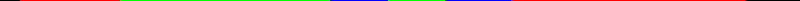

In this scenario, since we are looking at the scene from the top, we set the y-coordinate to `0` when rendering.

## [Back to 3D](https://github.com/ssloy/tinyrenderer/wiki/Lesson-3:-Hidden-faces-removal-(z-buffer)#back-to-3d)

When rendering a 3D scene into a 2D image, we need a *z-buffer* that is 2D dimensional to keep track of the largest z-value for each pixel `(x,y)`.

**How do we compute the z-value?** Recall how we computed the y-value:
```cpp
float t = (x-p0.x)/(float)(p1.x-p0.x);
int y = p0.y*(1.0 - t) + p1.y*t;
```

(which I thought was just linear interpolation...) But turns out that `1-t` and `t` are the *barycentric coordinates* of the point `(x,y)` with respect to points `p0` and `p1`:
```
(x,y) = p0*(1-t) + p1*t
```

So to find the z-coordinate, we can apply the same technique, by multiplying the z-coordinates of each point in the triangle (`p0`, `p1`, `p2`) which it's respective barycentric coordinate.

We computed the y-coordinate by adding some percentage `1-t` of `p0.y` with some percentage `t` with `p1.y`.

We compute the z-coordinate by adding some percentage `1 - u - v` of `p0.z` with some percentage `u` of `p1.z` with some percentage `v` of `p2.z`.

[This video](https://www.youtube.com/watch?v=p3tYG9im0aE) is a *great* explanation of the relationship between Barycentric coordinates, linear interpolation, and z-buffering! 

First bug:

I did update the logic to compute the barycentric coordinates... looks like they don't even render triangles anymore...

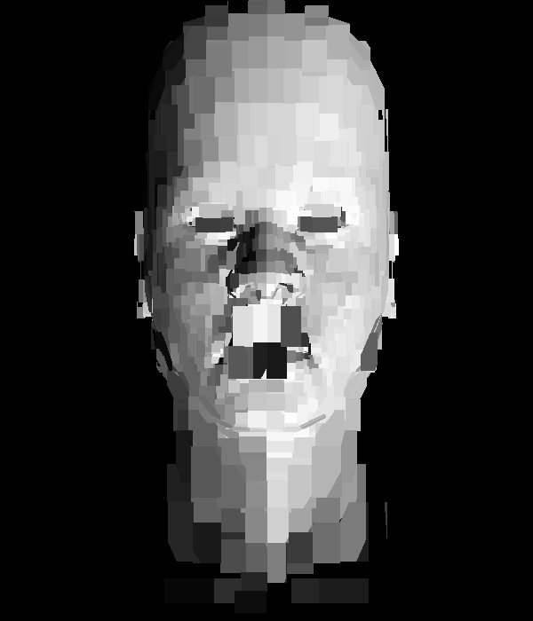

The bug was holding the `cross_product` in an `int` when computing `[u, v, 1]` (which is a float), but storing `[u, v, 1]` in the cross_product vector.

Fixed but still not looking right:

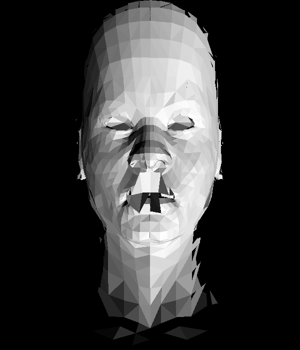

Better!! I was creating a new zbuffer per *triangle*, which is obviously useless 🤦.
Though it is still not rendered perfectly:


Weird floating point bug...

Removed the zbuffer and tested the following.

For some reason these lines of code (removes all strange black dots):
```cpp
coefficients.push_back(1.0 - (float)(cross_product_float[0] + cross_product_float[1]));
```

```cpp
coefficients.push_back(1.0 - (cross_product_float[0] + cross_product_float[1]));
```

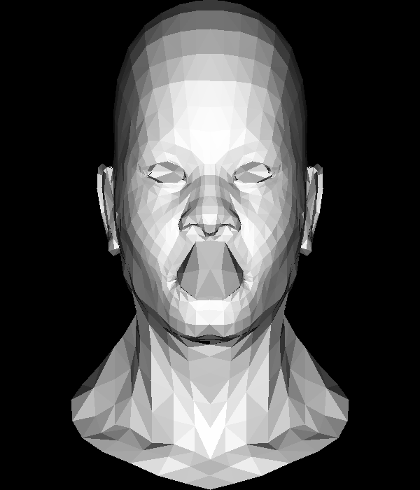

gives a different result than (some black dots):
```cpp
coefficients.push_back(1.0 - cross_product_float[0] - cross_product_float[1]);
```

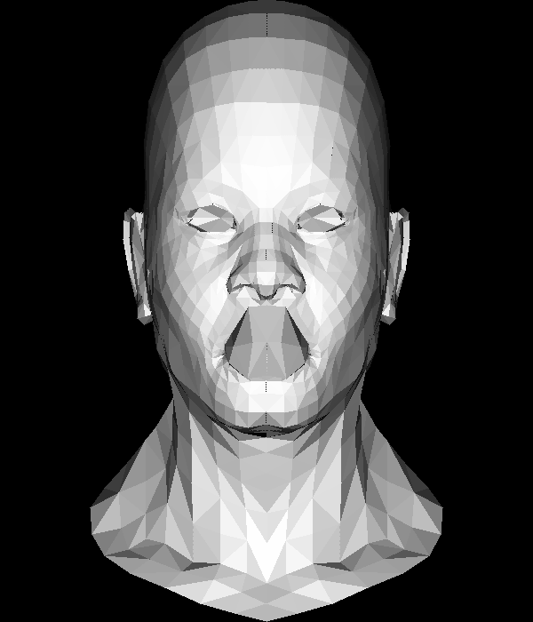

Added back the zbuffer calculation.

So this order definitely matters:
```cpp
// Now cross_product_float is of form: [u, v, 1];
// We can use the cross product vector to then compute
// the Barycentric coordinates: (1 - u - v, u, v)
std::vector<float> coefficients;
coefficients.push_back(1.0 - (cross_product_float[0] + cross_product_float[1]));
coefficients.push_back(cross_product_float[0]);
coefficients.push_back(cross_product_float[1]);
```
since it determines which barycentric coordinate value is multiplied to which axis (x, y, or z) of a triangle's world coordinate.

This order:
```cpp
coefficients.push_back(1.0 - (cross_product_float[0] + cross_product_float[1]));
coefficients.push_back(cross_product_float[0]);
coefficients.push_back(cross_product_float[1]);
```

creates:

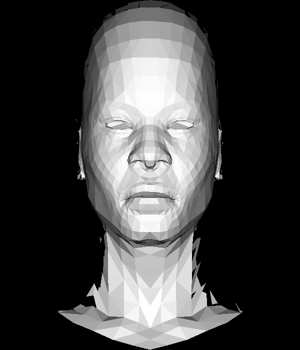

And this order:
```cpp
coefficients.push_back(cross_product_float[0]);
    coefficients.push_back(cross_product_float[1]);
    coefficients.push_back(1.0 - (cross_product_float[0] + cross_product_float[1]));
```

creates:

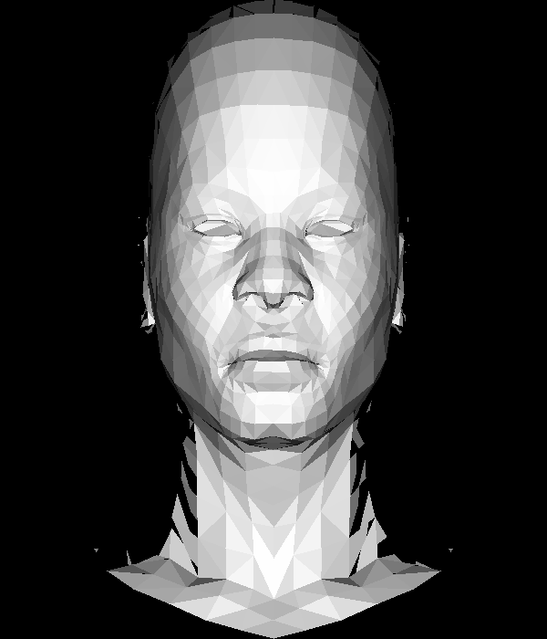

I tried to do a different way to compute the Barycentric coordinates, computing the cross product as the sub-triangle's area (following [this video](https://www.youtube.com/watch?v=p3tYG9im0aE)).

~~Looks like another floating point bug...~~ Nope! See below.

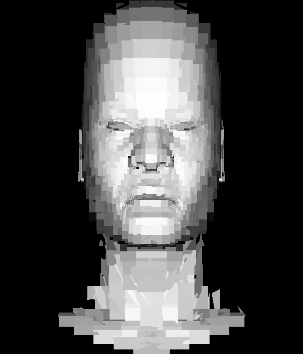

Though the neck is still cut off on the sides like the previous attempts...

So... the triangle areas method won't ever be negative... so we can't use it to check whether the point is inside the triangle or not.
```
// First method (using [u, v, 1])
(gdb) p barycentric_coordinates
$1 = std::vector of length 3, capacity 4 = {0.333333373, -0.333333343, 1}
```
```
// Triangle areas method
(gdb) p bc
$2 = std::vector of length 3, capacity 4 = {0.200000003, 0.600000024, 0.200000003}
```
```
// The triangle screen coordinates
(gdb) p t
$3 = std::vector of length 3, capacity 3 = {{x = 346, y = 302, z = 0}, {x = 347, y = 304, z = 0}, {x = 349, 
    y = 305, z = 0}}    
```

Only when the point is in the triangle, both computation results are the same:
```

(gdb) p barycentric_coordinates
$4 = std::vector of length 3, capacity 4 = {0.448275864, 0.534482777, 0.0172413792}
(gdb) p bc
$5 = std::vector of length 3, capacity 4 = {0.448275864, 0.534482777, 0.0172413792}
(gdb) p t
$6 = std::vector of length 3, capacity 3 = {{x = 366, y = 232, z = 0}, {x = 382, y = 244, z = 0}, {x = 392, 
    y = 266, z = 0}}
(gdb)     
```

So turns out that it is *not* a floating point bug, but since the triangle area method always returns positive barycentric coordinates, it simply fills the entire bounding box for each triangle...

It looks like some pixels that are supposed to be drawn, are too low when compared to its zbuffer entry.

Here I colored the pixel red if it didn't pass the zbuffer comparison:

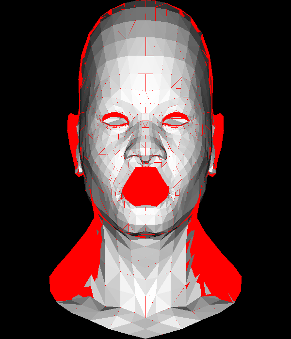

So inside the mouth is correct... The ears and neck sides though, should be drawn.

Oh, interesting, in the case the pixel fails the zbuffer comparison, the calculated z-value and the value in the zbuffer are exactly the same:
```
(gdb) p z
$3 = 0.249689996
(gdb) p zbuffer[x][y]
$4 = 0.249689996
```

Changing the comparison to `>=` did nothing.

Let's observe what happens at pixel `(x=180, y=100)` (found coordinate through trial and error...):

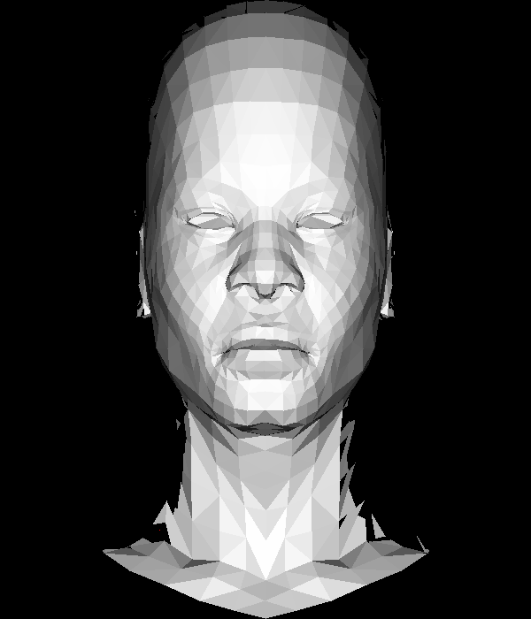

A triangle should be drawn where the red dot is, but it isn't.

🪲 The bug!!!! Was initializing the zbuffer values:
```cpp
std::vector<std::vector<float>> zbuffer(
    width,
    std::vector<float>(height, std::numeric_limits<float>::min())
);
```
Turns out that [`numeric_limits<float>::min()`](https://en.cppreference.com/w/cpp/types/numeric_limits) is the lowest *positive* float... (the macro [`FLT_MIN`](https://en.cppreference.com/w/cpp/types/climits)). The calculated z-coordinate could be negative, but it was never greater than the default z-buffer value.

Fixed! ✨

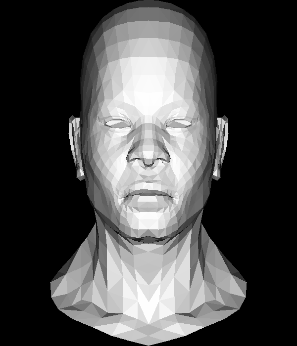

## [Texture](https://github.com/ssloy/tinyrenderer/wiki/Lesson-3:-Hidden-faces-removal-(z-buffer)#okay-we-just-interpolated-the-z-values-what-else-can-we-do)

First (incorrect) attempt at applying textures:

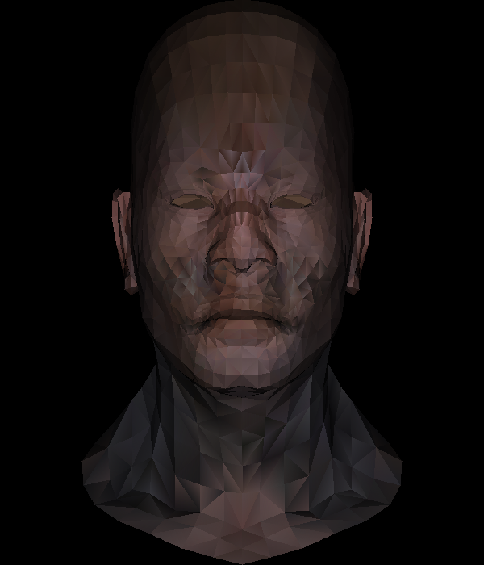

The steps I took:
1. Got the texture coordinate *index* for each vertex in the triangle
2. Used that index to index into the Model's array of texture coordinates to get the actual texture coordinates
3. Multiplied texture image width and height with the texture coordinates (because the texture coordinates are normalized between [0, 1]), then used these computed values to index into the texture image to obtain the color.
4. Get a color for each vertex of the triangle (get 3 colors total per triangle)
5. Used the same barycentric coordinates to compute how much of each color contributes to the inner color of a pixel in the triangle

Looks like there's still a bug... Will investigate later.

I turned off applying light intensity just to make sure it was supposed to be applied, it totally is.
Scary result without:

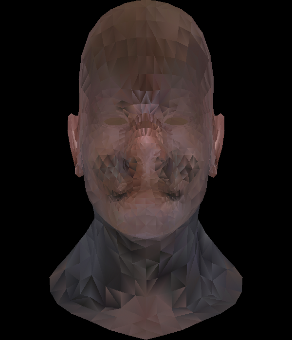

It kinda looks like the texture is flipped upside down.

I added this line after loading the texture image:
```cpp
texture_image.flip_vertically();
```

And it looks better:

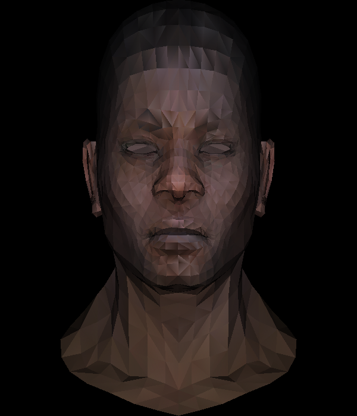

Though it looks mosaic-y still, especially the top of the head should be more blended together... So it must be an issue with barycentric coordinates / lerping between triangles.

Here I mapped the UV coordinates as colors:
```cpp
TGAColor(texture_coordinate.x*255, texture_coordinate.y.255, 0, 255);
```

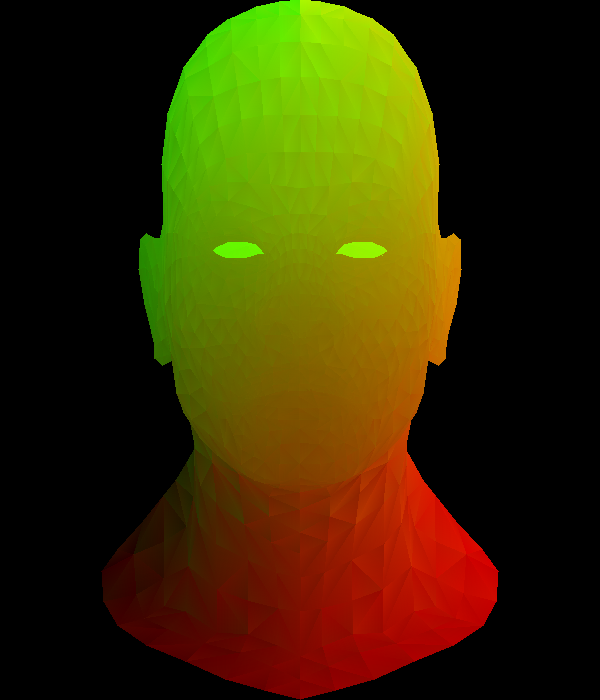

First, even solid colors are not interpolated correctly? There are discontinuities between triangles, like the gradients seem flipped between triangles so you can see the edges of each triangle.

The mapping looks correct since bottom-right should be most red, top right should be yellow, top-left should be green.

The following experiment makes more sense. I assigned each vertex a solid color (red, green, blue) and interpolated the triangles:

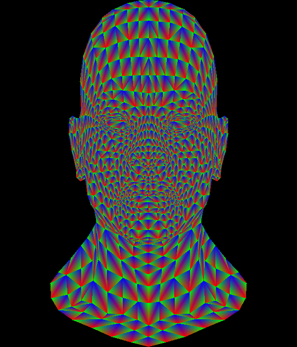

One observation is that the coordinates can be *either* counter-clockwise or clockwise (the direction determined by the order red -> green -> blue are in the triangle).

Maybe the colors are not mapped to the correct vertex because it should be up to the model's definition to align colors between triangles to be similar?

Interpolated texture without lighting:

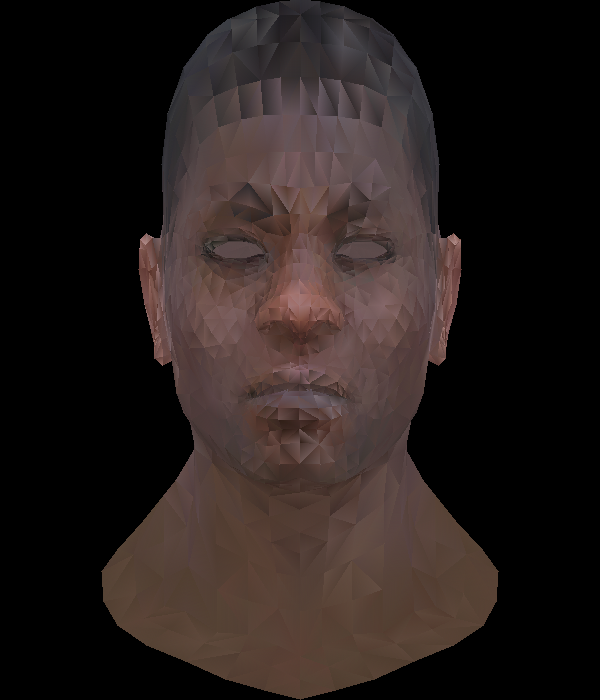

I cheated a bit and searched the web... Apparently people interpolate the UV coordinates, *not* the colors!! That never crossed my mind...

This is how the UV coordinates are now calculated for the pixel:
```cpp
float u = 0.0;
float v = 0.0;
for (int i=0; i<3; i++) { // for each vertex
    z += (t_world[i].z*barycentric_coordinates[i]);
    if (i == 0) u += (uv_coordinates[i].x * barycentric_coordinates[i]);
    else if (i == 1) v += (uv_coordinates[i].y * barycentric_coordinates[i]);
}
```

Then I compute the color by obtaining the base color from the texture image, then applying the light intensity:
```cpp
TGAColor base_color = texture_image.get((int)floor(u), (int)floor(v));
TGAColor color(
    base_color.r * light_intensity,
    base_color.g * light_intensity,
    base_color.b * light_intensity,
    255 // opacity
);
image.set(x, y, color);
```

Welp, still lookin' weird:

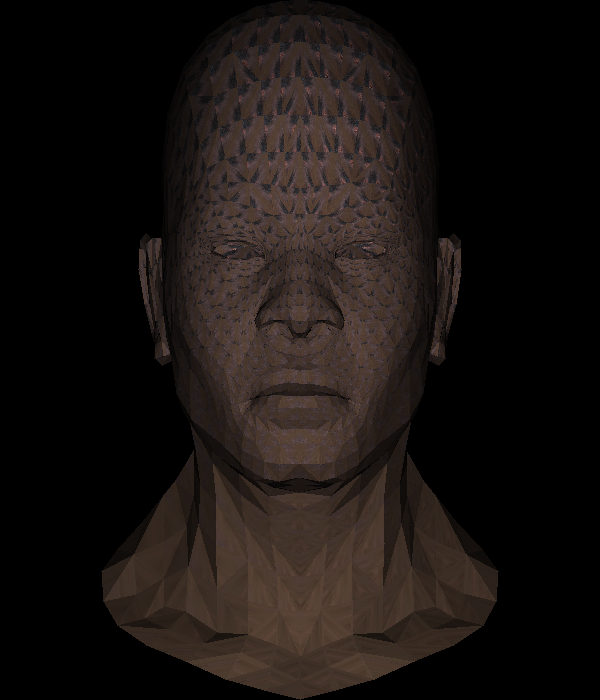

Actually this logic here is a bug, it should not check for `i`, it should just add them all:
```cpp
for (int i=0; i<3; i++) { // for each vertex
    z += (t_world[i].z*barycentric_coordinates[i]);
    if (i == 0) u += (uv_coordinates[i].x * barycentric_coordinates[i]);
    else if (i == 1) v += (uv_coordinates[i].y * barycentric_coordinates[i]);
}
```

Fixed that to:
```cpp
for (int i=0; i<3; i++) { // for each vertex
    z += (t_world[i].z*barycentric_coordinates[i]);
    u += (uv_coordinates[i].x * barycentric_coordinates[i]);
    v += (uv_coordinates[i].y * barycentric_coordinates[i]);
    std::cout << "texture coordinate vertex " << i << ": " << uv_coordinates[i] << std::endl;
}
```

And also passed in the *normalized* uv_coordinates here (so the value taken directly from the wave object file), instead of the image coordinates of the texture image.
I then calculate the image coordinates later after multiplying the normalized texture coordinates by the barycentric coordinates.

```cpp
int texture_image_x = u * texture_image.get_width();
int texture_image_y = v * texture_image.get_height(); 
std::cout << "uv (int)=(" << texture_image_x<< "," << texture_image_y<< ")" << std::endl;
TGAColor base_color = texture_image.get(texture_image_x, texture_image_y);
TGAColor color(
    base_color.r * light_intensity,
    base_color.g * light_intensity,
    base_color.b * light_intensity,
    255 // opacity
);
```

Definitely better, the rough hair and skin shows more, but still not quite there... Still looks blocky. It still feels like some triangle's texture colors are flipped:

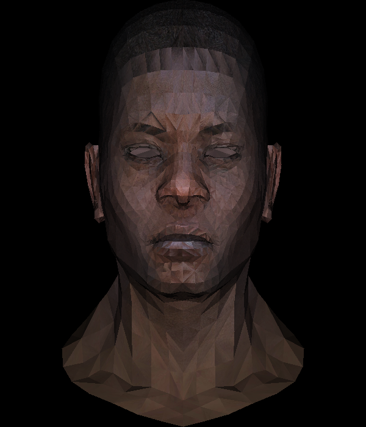

I am running to the exact same problem as [this user](https://github.com/ssloy/tinyrenderer/issues/105), which is also in a Visual Troubleshooting page: https://github.com/ssloy/tinyrenderer/wiki/Visual-troubleshooting#texturing

So apparently the order of Barycentric coordinates is incorrect. It isn't the obvious mapping of:
```
v0 -> barycentric_coordinates[0]
v1 -> barycentric_coordinates[1]
v2 -> barycentric_coordinates[2]
```

This is using the reverse order, which looks better,  but not correct:
```
v0 -> barycentric_coordinates[2]
v1 -> barycentric_coordinates[1]
v2 -> barycentric_coordinates[0]
```

```cpp
std::vector<int> indices = {2, 1, 0};
for (int i=0; i<3; i++) { // for each vertex
    z += (t_world[i].z*barycentric_coordinates[indices[i]]);
    u += (uv_coordinates[i].x * barycentric_coordinates[indices[i]]);
    v += (uv_coordinates[i].y * barycentric_coordinates[indices[i]]);
}
```

(no lighting):

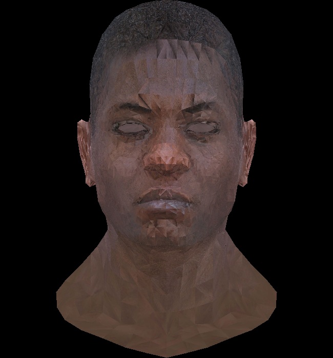


(with lighting)
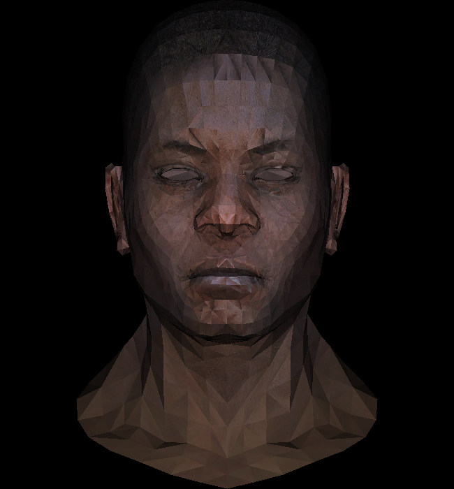

I compared my RGB interpolation attempt with [this user's RGB interpolation](https://github.com/ssloy/tinyrenderer/issues/105#issuecomment-1165139104) and I noticed that our RGB colors are in reverse order.

The following order:
```
v0 -> barycentric_coordinates[2]
v1 -> barycentric_coordinates[0]
v2 -> barycentric_coordinates[1]
```

gives me:


This is what my interpretation of what [this comment](https://github.com/ssloy/tinyrenderer/issues/105#issuecomment-1165139508) is trying to say:

```
v0 -> barycentric_coordinates[0]
v1 -> barycentric_coordinates[2]
v2 -> barycentric_coordinates[1]
```

Though still not correct...

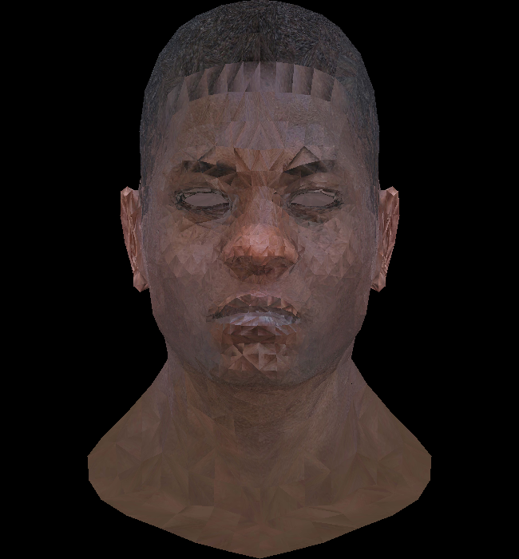
