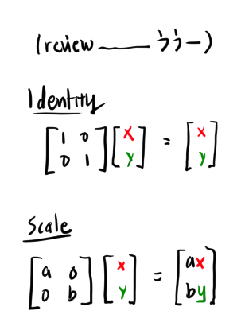
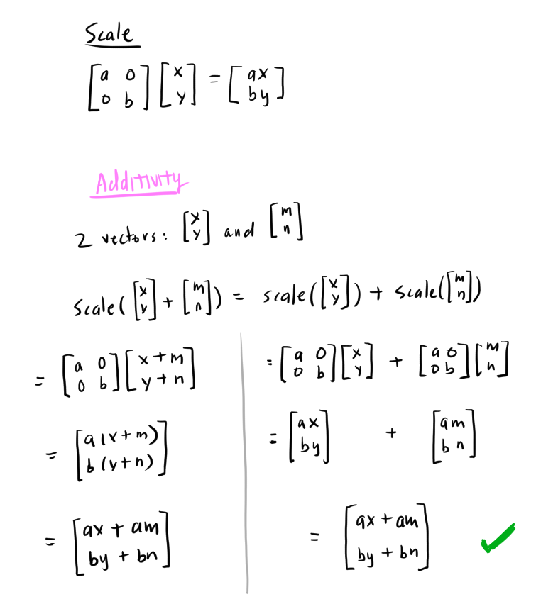
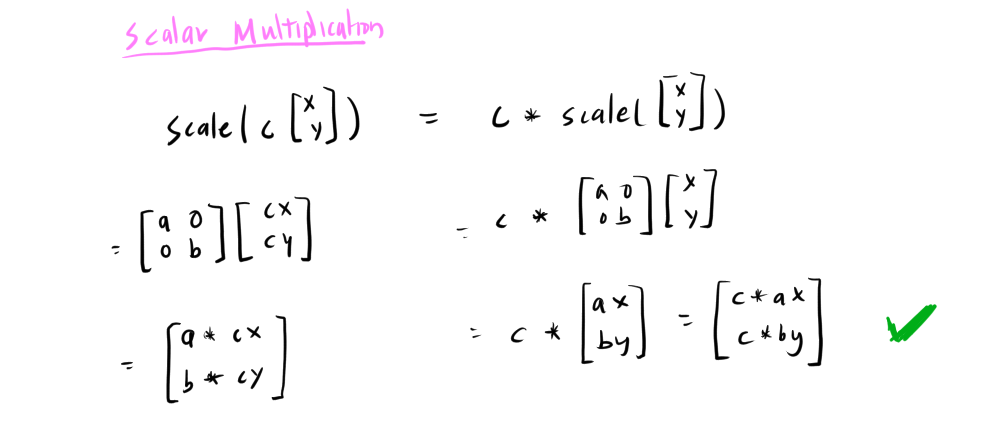
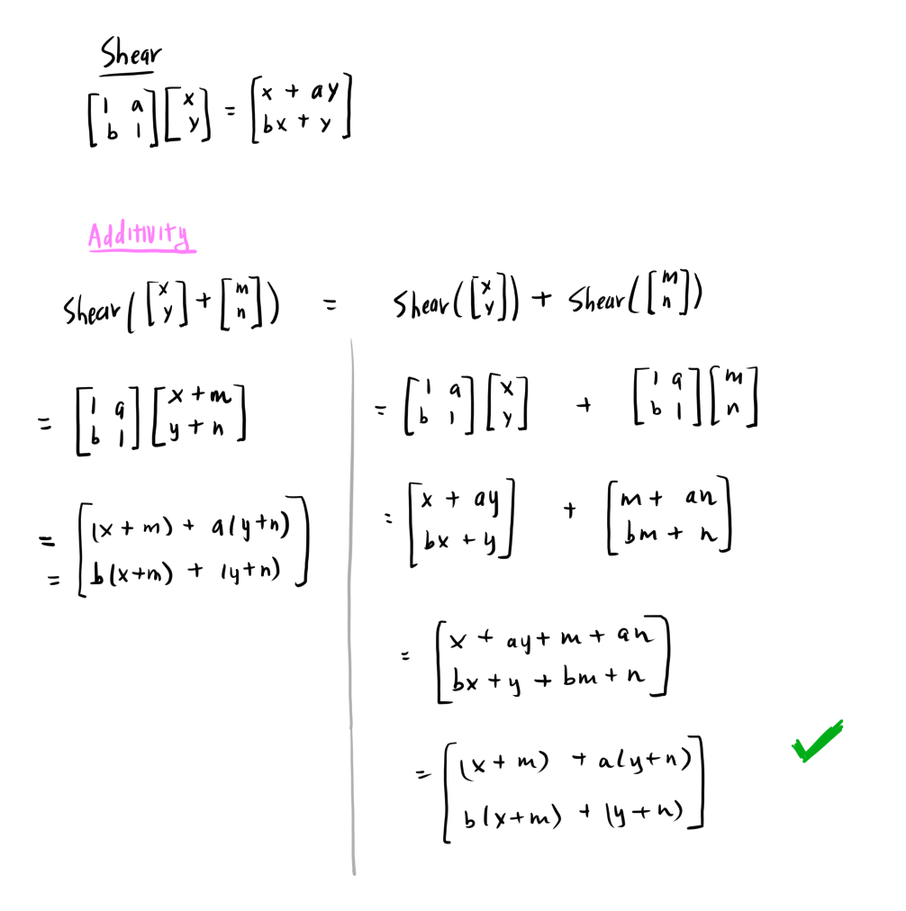
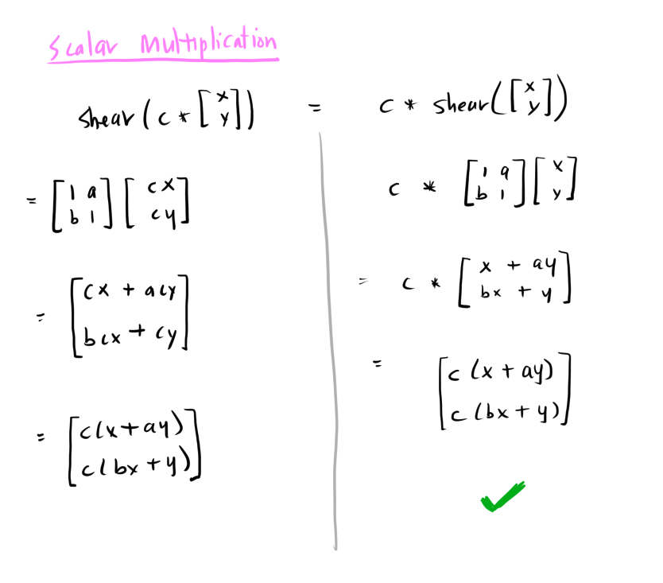
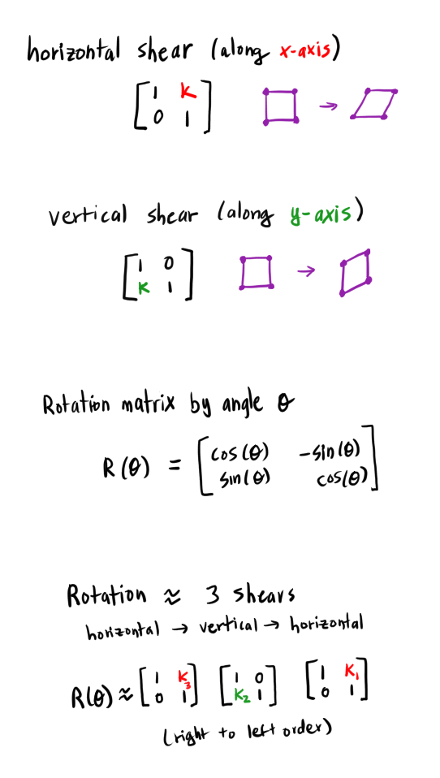
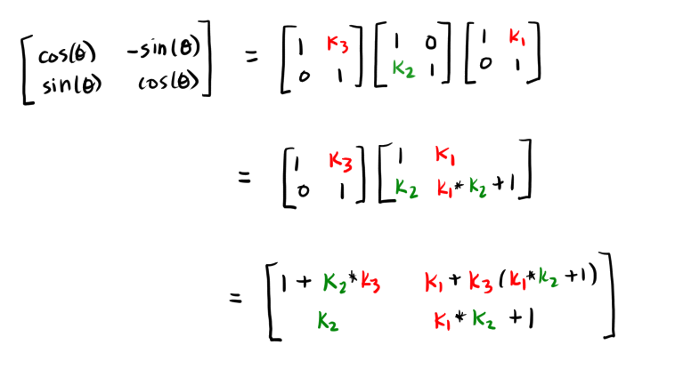
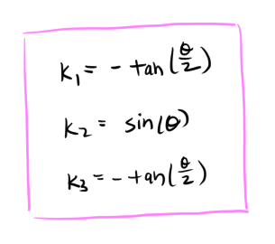
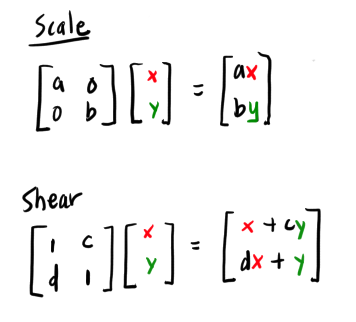

# [Lesson 4: Perspective Projection](https://github.com/ssloy/tinyrenderer/wiki/Lesson-4:-Perspective-projection)

## [Linear Transformations](https://github.com/ssloy/tinyrenderer/wiki/Lesson-4:-Perspective-projection#linear-transformations)

A *linear transformation* is mathematical operation that satisfies two properties:

1. Additivity
```
f(x1 + x2) = f(x1) + f(x2)
```
We can combine the arguments `x1` and `x2` and then apply the operation, and that is equivalent to applying
the operation on each argument, and combining the result.

2. Scalar Multiplication
```
f(c*x) = c * f(x)
```
If `c` is a scalar, then the scaling the argument `x` by `c` then applying the operation is equivalent to
applying the operation on `x` and scaling the result by `c`.



Why scaling is linear:





A *shear* distorts a shape in a particular direction. To skew along the x-axis, we add a constant that is proportional to a y-value of a point `(x,y)`:
```
x' = x + s*y
y' = y
```

A shear is also a linear operation:





Any rotation can be represented as three shears.

Paper on this algorithm: [A fast algorithm for general raster rotation](http://graphicsinterface.org/wp-content/uploads/gi1986-15.pdf)

(according to ChatGPT) the derivation:

A rotation matrix can be represented as a horizontal shear, vertical shear, and another horizontal shear:



We then solve for the three *shear factors*, `k1`, `k2`, and `k3`:




The shear factors:



(I guess this was just a slight tangent because we never see these again...)

## [2D Affine transformations](https://github.com/ssloy/tinyrenderer/wiki/Lesson-4:-Perspective-projection#2d-affine-transformations)

Actually the point of the shear exercise was to show that any linear transformation on a plane can be represented as a composition of scale and shear transformations.



With only scale and shear, the origin would not move. We can apply translation.

Though the translation operation is *not* linear.
