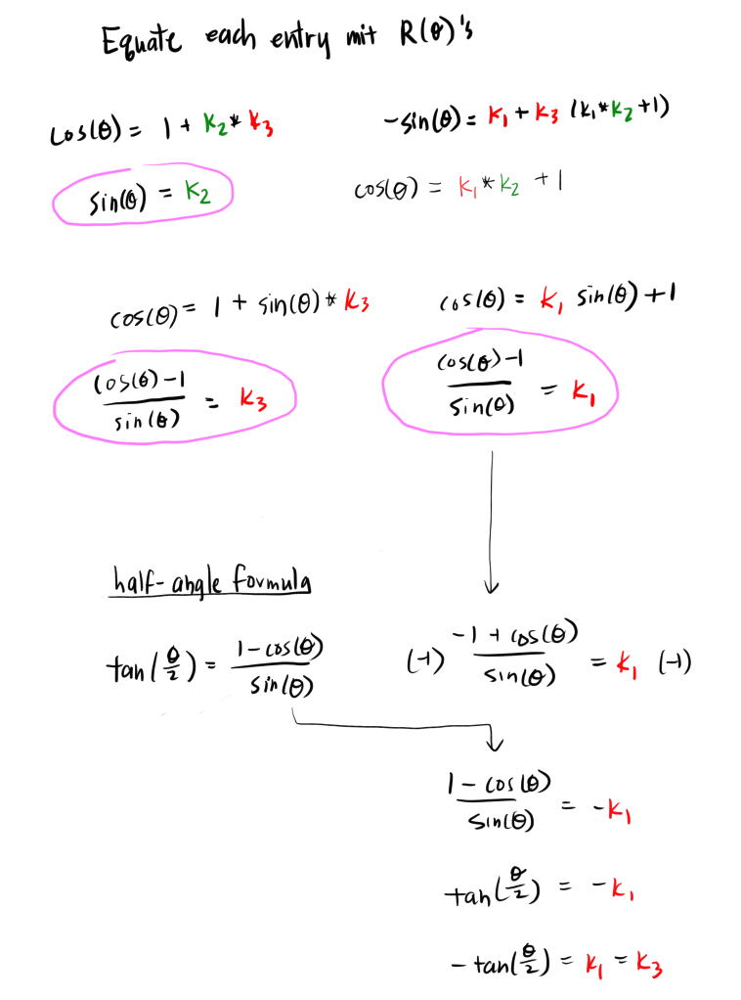
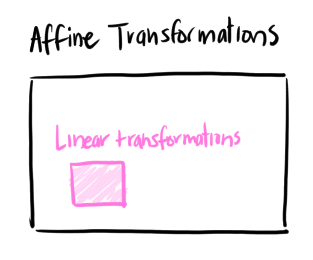

# [Lesson 4: Perspective Projection](https://github.com/ssloy/tinyrenderer/wiki/Lesson-4:-Perspective-projection)

## [Linear Transformations](https://github.com/ssloy/tinyrenderer/wiki/Lesson-4:-Perspective-projection#linear-transformations)

A *linear transformation* is mathematical operation that satisfies two properties:

1. Additivity
```
f(x1 + x2) = f(x1) + f(x2)
```
We can combine the arguments `x1` and `x2` and then apply the operation, and that is equivalent to applying
the operation on each argument, and combining the result.

2. Scalar Multiplication
```
f(c*x) = c * f(x)
```
If `c` is a scalar, then the scaling the argument `x` by `c` then applying the operation is equivalent to
applying the operation on `x` and scaling the result by `c`.


Why scaling is linear:


A *shear* distorts a shape in a particular direction. To skew along the x-axis, we add a constant that is proportional to a y-value of a point `(x,y)`:
```
x' = x + s*y
y' = y
```

A shear is also a linear operation:


Any rotation can be represented as three shears. Rotation is also a linear operation.

Paper on this algorithm: [A fast algorithm for general raster rotation](http://graphicsinterface.org/wp-content/uploads/gi1986-15.pdf)

(according to ChatGPT) the derivation:

A rotation matrix can be represented as a horizontal shear, vertical shear, and another horizontal shear:


We then solve for the three *shear factors*, `k1`, `k2`, and `k3`:




The shear factors:


(I guess this was just a slight tangent because we never see these again...)

## [2D Affine transformations](https://github.com/ssloy/tinyrenderer/wiki/Lesson-4:-Perspective-projection#2d-affine-transformations)

Actually the point of the shear exercise was to show that any linear transformation on a plane can be represented as a composition of scale and shear transformations.


With only scale and shear, the origin would not move. We can apply translation.

Though the translation operation is *not* linear.


Translation is an *affine transformation*, which is a type of transformation that preserves lines and parallelism, but not guaranteed to preserve angles and length of lines.

Affine transformations are a more general class of transformations, and linear transformations are a type of affine transformation:



Therefore, every linear transformation is affine, but not every affine transformation is linear. For example, pure linear transformations preserve the origin, but an affine transformation may not (ex. translation).

Every affine transformation can be represented as a combination of linear transformations (scale, shear, and rotation) and a translation:
```
p' = A*p + t
```

where `A` is a linear transformation matrix, point `p`, and translation `t`.

To compose multiple affine transformations together, we can do something like this:


which can become very clunky if we had to compose even more operations.

## [Homogeneous coordinates](https://github.com/ssloy/tinyrenderer/wiki/Lesson-4:-Perspective-projection#homogeneous-coordinates)

If we extend our linear transformation from a 2x2 matrix to a 3x3 matrix and include the translation into the matrix, we now have one matrix to represent the full affine transformation:


We also extend our input point `(x,y)` from 2D to 3D by appending a 1 to the z-coordinate; the point now becomes a *homogeneous coordinate*.

Essentially we are mapping the 2D transformation into 3D space: the transformation happens in 3D space but on a 2D plane, where z=1.

To convert the 3D point `(x,y,z)` back to a 2D point `(x',y')`, we simply divide each component by the z-coordinate:
```
x' = x/z
y' = y/z
```

(old notes on [the z-divide](https://github.com/atskae/computer-graphics/tree/master/scratch-a-pixel/notes/01-introduction)).

([why x/z works, illustration](https://www.cse.unr.edu/~bebis/CS791E/Notes/PerspectiveProjection.pdf))


