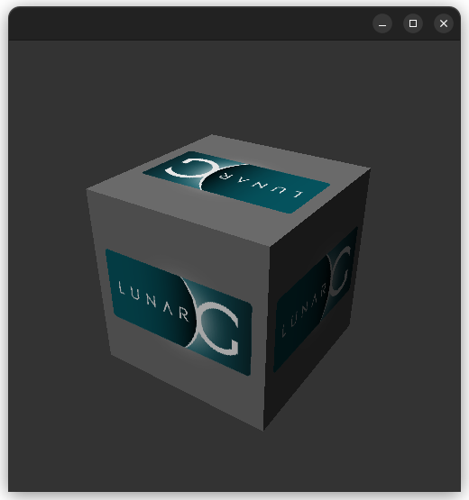

# Vulkan Tutorial

Notes from [Vulkan Tutorial](https://docs.vulkan.org/tutorial/latest/00_Introduction.html)

## [Setup Development Environment (Linux)](https://docs.vulkan.org/tutorial/latest/02_Development_environment.html#_linux)

### Vulkan Packages

Install command line utilities:
```
sudo apt install vulkan-tools 
```

Check that the commands `vulkaninfo` and `vkcube` work after installation.

`vkcube` should output a window:



([LunarG](https://en.wikipedia.org/wiki/LunarG) develops the Vulkan SDK).

Install the Vulkan loader:
```
sudo apt install libvulkan-dev 
```

At runtime, the Vulkan loader discovers all the driver functions.

Install debugging tools: validation layers and [SPIR-V](https://www.khronos.org/spir/):
```
sudo apt install vulkan-validationlayers-dev spirv-tools
```

[SPIR-V](https://www.khronos.org/spir/) is:
> the first open standard, cross-API intermediate language for natively representing parallel compute and graphics

### [X Window System](https://en.wikipedia.org/wiki/X_Window_System)

Install:
```
sudo apt install libxxf86vm-dev
```

This installation provides an interface to [`XFree86-VidModeExtension`](https://www.xfree86.org/current/XF86VidMode.3.html):

> These functions provide an interface to the server extension XFree86-VidModeExtension which allows the video modes to be queried and adjusted dynamically and mode switching to be controlled.

Install: 
```
sudo apt install libxi-dev
```

This installation provides a X window system client to the [`XINPUT` extension](http://refspecs.linux-foundation.org/X11/Xinput.pdf):

> The purpose of this extension is to support the use of additional input devices beyond the pointer and keyboard devices defined by the
core X protocol.

### GLFW

[GLFW](https://www.glfw.org/) is a cross-platform library that allows us to create windows and receiving input and output events. Install the GLFW library with:
```
sudo apt install libglfw3-dev
```

### GLM

Install the linear algebra library GLM:
```
sudo apt install libglm-dev
```

### Shader Compiler

We need a compiler that can compile GLSL (a human-readable shader language) to bytecode.

There are two common options for shader compilers: Khronos Group's `glslangValidator` and Google's `glslc`.

We will install `glslc`, which can be downloaded from [Google's `shaderc` GitHub repository](https://github.com/google/shaderc/blob/main/downloads.md).

Once it is downloaded, move the compiler binary to `/usr/local/bin`:
```
tar -xvzf install.tgz
sudo cp install/bin/glslc /usr/local/bin/
```

Check that the installation worked by running `glslc`. It should print the following expected error:

```
$ glslc
glslc: error: no input files
```
